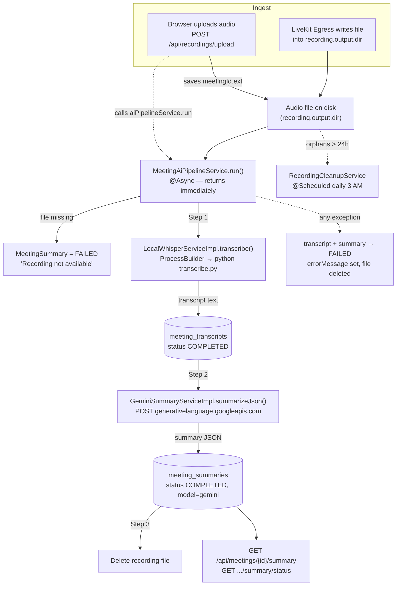
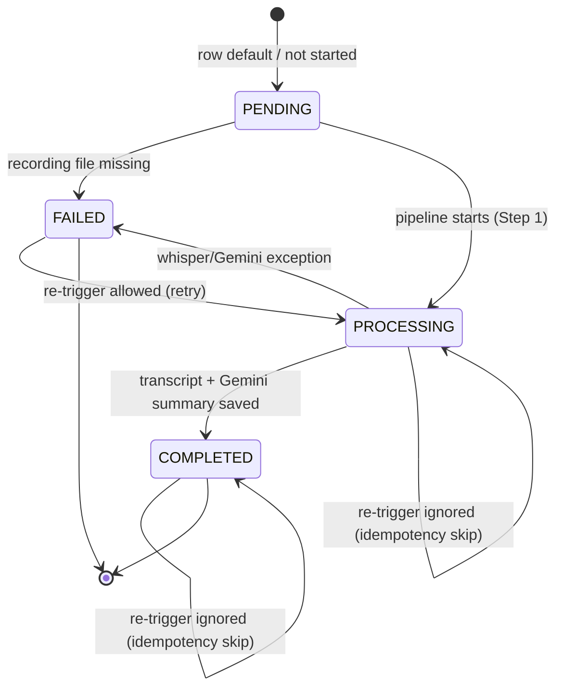
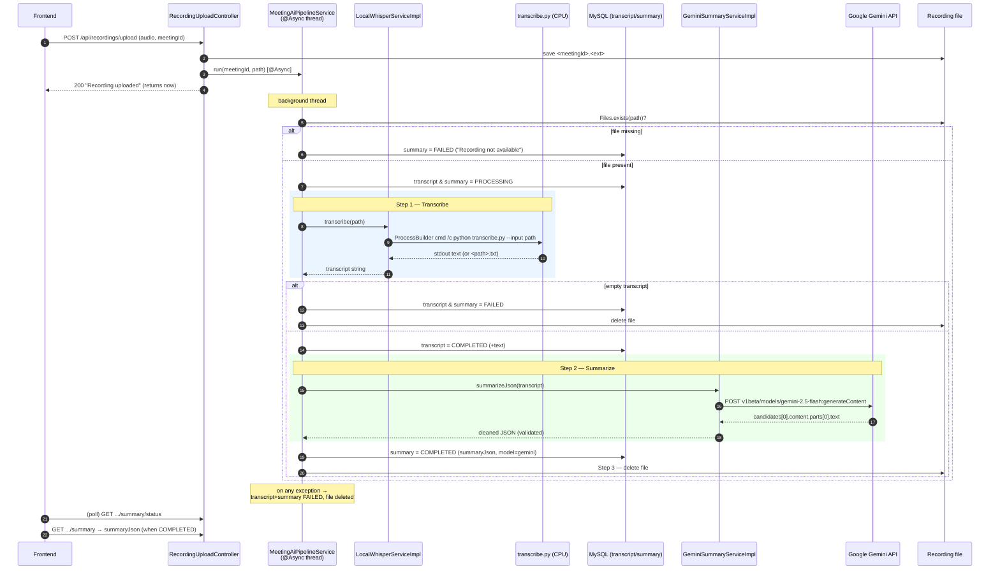

# AI Pipeline — Recording → Transcription → Summary

This document explains the end-to-end AI pipeline of the video-conferencing backend: how a meeting recording becomes a structured, AI-generated summary that the frontend can fetch.

The pipeline has three stages, all kicked off from a single async call:

1. **Recording file** lands on disk (via direct browser **upload**, or written by **LiveKit Egress** into the recordings directory).
2. **Transcription** — a local **faster-whisper** Python script (CPU) turns the audio into text.
3. **Summarization** — **Google Gemini** turns the transcript into structured JSON (`executiveSummary`, `keyPoints`, `decisions`, `actionItems`, `risks`, `openQuestions`, `followUps`).

The recording file is **deleted** after processing (success or failure). Results are persisted in MySQL and exposed via REST so the frontend can poll job status and fetch the summary.

---

## 1. Overview diagram



> **Note on Egress:** `MeetingAiPipelineService.run` is only invoked directly by `RecordingUploadController` (`RecordingUploadController.java:51`). If a file arrives purely via LiveKit Egress with no upload call, nothing triggers the pipeline for it — and such orphans are reaped by the daily cleanup. The `MeetingRecording` entity/repository exists to record the egress path but is **not** referenced by the pipeline code in this module.

---

## 2. JobStatus enum & state machine

`JobStatus.java:4` — a single flat enum reused by both `MeetingTranscript` and `MeetingSummary`:

| Value | Meaning | Set where |
|-------|---------|-----------|
| `PENDING` | Default on new entity / row never created. The status controller reports this when no row exists. | Entity defaults (`MeetingSummary.java:12`, `MeetingTranscript.java:13`); synthesized in `MeetingSummaryController.java:23` |
| `PROCESSING` | Stage actively running. | `MeetingAiPipelineService.java:80,83` |
| `COMPLETED` | Stage finished successfully. | `MeetingAiPipelineService.java:94` (transcript), `:104` (summary) |
| `FAILED` | Stage threw, or recording file missing. `errorMessage` is populated. | `MeetingAiPipelineService.java:52,118,122` |

### Summary row state machine



**Idempotency:** `MeetingAiPipelineService.java:73` short-circuits if the **summary** status is already `PROCESSING` or `COMPLETED`. A `FAILED` summary is therefore retryable (re-uploading re-runs it), but a `PENDING` row also proceeds.

---

## 3. MeetingAiPipelineService — the orchestrator

File: `MeetingAiPipelineService.java`. One public method, `run`, annotated `@Async`.

### `@Async` & AsyncConfig

`run` is marked `@Async` (`MeetingAiPipelineService.java:34`). Async support is enabled globally by `AsyncConfig.java`:

```java
@Configuration
@EnableAsync
public class AsyncConfig {}
```

There is **no custom `TaskExecutor` bean** — Spring uses its default async executor. The effect: when `RecordingUploadController` calls `aiPipelineService.run(...)` (`RecordingUploadController.java:51`), the HTTP request returns `200 "Recording uploaded successfully"` **immediately** while transcription + summarization run on a background thread. The whole job can take minutes (whisper timeout is 30 min), so this is essential.

> Because `@Async` returns `void`, the controller cannot observe success/failure — clients learn the outcome by polling `/summary/status` (see §9).

### `run(String meetingId, String audioFilePath)` — step by step

| Step | Lines | What happens |
|------|-------|--------------|
| Guard: file exists? | `:39–56` | If the audio path doesn't exist, logs a LiveKit-free-tier hint, sets summary `FAILED` with message *"Recording not available…"*, and returns. |
| Load/create rows | `:59–70` | Gets-or-creates `MeetingTranscript` and `MeetingSummary` rows keyed by `meetingId`. |
| Idempotency skip | `:73–76` | If summary already `PROCESSING`/`COMPLETED`, log and return. |
| **Step 1 — transcribe** | `:80–96` | Set transcript + summary to `PROCESSING` and save. Call `whisper.transcribe(audioFilePath)`. If transcript is null/blank → throw `RuntimeException("Whisper returned empty transcript")`. Else store text, set transcript `COMPLETED`, save. |
| **Step 2 — summarize** | `:99–106` | Call `gemini.summarizeJson(transcript)`. Store result in `summaryJson`, set `model = "gemini"`, status `COMPLETED`, save. |
| **Step 3 — delete file** | `:109` | `deleteRecordingFile(audioFilePath)` removes the audio to reclaim disk. |
| Error handling | `:111–128` | Any exception: build a truncated (≤500 char) `ClassName: message` string, set **both** transcript and summary to `FAILED` with `errorMessage`, save, **then still delete the recording**. |

`deleteRecordingFile` (`:135–148`) is best-effort: it never throws — a deletion failure is logged but doesn't break the pipeline.

---

## 4. LocalWhisperServiceImpl — local transcription

Interface: `LocalWhisperService.java` → `String transcribe(String audioFilePath)`.
Impl: `LocalWhisperServiceImpl.java`.

### How whisper is invoked

The command template comes from the `whisper.command` property (`LocalWhisperServiceImpl.java:21`). From `application.properties:34`:

```
whisper.command=${WHISPER_COMMAND:python3 AI/transcribe.py --input "%s" --model base --device cpu --compute_type int8}
```

- It is a **format string**: `%s` is replaced at runtime with the audio file path (`:31`).
- Default invokes a **faster-whisper** Python script `AI/transcribe.py`, model `base`, on **CPU**, `int8` compute. Overridable via the `WHISPER_COMMAND` env var (e.g. absolute paths on Windows).

The command is run via `ProcessBuilder`, wrapped in **`cmd /c`** (Windows-specific), with stderr merged into stdout (`:34–36`):

```java
Process p = new ProcessBuilder("cmd", "/c", cmd)
        .redirectErrorStream(true)
        .start();
```

### Input / output / parsing

- **Input audio format:** whatever the file is — the script accepts the path; the uploaded file keeps its original extension (`webm` default, see §6). faster-whisper decodes via ffmpeg.
- **Output collection** (`:39–64`):
  1. Read **all** of the merged stdout/stderr into a UTF-8 string (read before/around `waitFor` to avoid pipe deadlock on large output).
  2. `waitFor` up to **30 minutes** (`TIMEOUT_MINUTES`, `:25`/`:41`); on timeout → `destroyForcibly()` and throw.
  3. Non-zero **exit code** → throw `RuntimeException` with the captured output (`:47–51`).
  4. **Transcript resolution:** if a sibling file `<audioFilePath>.txt` exists, read and trim it (`:54–58`). Otherwise fall back to the **trimmed stdout** of the process (`:62–64`) — i.e. whatever `transcribe.py` printed.
- **Interruption** sets the interrupt flag and rethrows (`:66–68`); any other error is wrapped (`:69–72`).

---

## 5. GeminiSummaryServiceImpl — the LLM call (Google Gemini)

Interface: `GeminiSummaryService.java` → `String summarizeJson(String transcriptText)`.
Impl: `GeminiSummaryServiceImpl.java`. Uses a plain `RestTemplate` (`:26`) and Jackson `ObjectMapper` (`:27`).

> This is **Google Gemini**, not Anthropic/Claude — documented exactly as coded.

### Configuration

| Property | Source | Value |
|----------|--------|-------|
| `gemini.api.key` | `application.properties:28` | `${GEMINI_API_KEY}` (env) |
| `gemini.model` | `application.properties:29` | `gemini-2.5-flash` |

> ⚠️ **Discrepancy in code:** the `model` field defaults to `gemini-2.0-flash` (`:23`) and is logged (`:64`), but the **actual request URL hardcodes `gemini-2.5-flash`** (`:57`). So the configured/logged `model` value does **not** affect which model is called — the URL wins.

### Exact HTTP call

- **Method:** `POST`
- **URL** (`:57`):
  ```
  https://generativelanguage.googleapis.com/v1beta/models/gemini-2.5-flash:generateContent?key=<API_KEY>
  ```
  (API key passed as a query param; logged with the key masked as `***`, `:59`.)
- **Headers** (`:61–62`): `Content-Type: application/json`.
- **Body** (`:55`) — Gemini `generateContent` shape, prompt JSON-escaped via Jackson:
  ```json
  { "contents": [ { "parts": [ { "text": "<prompt + transcript>" } ] } ] }
  ```

### Prompt text (`:36–53`)

```
You are a meeting summarization assistant.
Analyze the following meeting transcript and return ONLY valid JSON
(no markdown fences, no explanation) with these exact keys:

{
  "executiveSummary": "A concise 2-3 sentence overview of the meeting",
  "keyPoints": ["point 1", "point 2", ...],
  "decisions": ["decision 1", "decision 2", ...],
  "actionItems": [{"owner": "person", "task": "description", "deadline": "if mentioned"}],
  "risks": ["risk 1", "risk 2", ...],
  "openQuestions": ["question 1", "question 2", ...],
  "followUps": ["follow-up 1", "follow-up 2", ...]
}

If a section has no items, use an empty array [].

Transcript:
<transcriptText appended here>
```

### Response parsing (`:67–85`)

1. Non-2xx or null body → throw `RuntimeException("Gemini API returned <status>")`.
2. Extract text from the first candidate:
   ```
   candidates[0].content.parts[0].text
   ```
3. **Strip markdown fences** in case Gemini wraps the JSON: regex removes a leading ` ```lang ` and trailing ` ``` ` (`:77–80`).
4. **Validate** the result parses as JSON (`mapper.readTree(text)`, `:83`) — if not, it throws.
5. Return the cleaned JSON **string** (stored verbatim into `MeetingSummary.summaryJson`).

On any failure (`:87–93`) it logs, gives an extra hint if the message contains `API_KEY_INVALID`, and rethrows a wrapped `RuntimeException` — which propagates up to the pipeline's catch block and marks the summary `FAILED`.

---

## 6. RecordingUploadController — how a file enters the system

File: `RecordingUploadController.java`, base path `/api/recordings`.

`POST /api/recordings/upload` (multipart):

| Param | Type | Notes |
|-------|------|-------|
| `audio` | `MultipartFile` | the recording (browser-recorded blob) |
| `meetingId` | `String` | meeting identifier (becomes the filename + DB key) |

Flow (`:30–58`):
1. Ensure `recording.output.dir` exists (`:41`).
2. Derive extension from the original filename; default **`webm`** if absent (`getFileExtension`, `:62–69`).
3. Save the file as **`<meetingId>.<ext>`** in the output dir, replacing any existing file (`:44–47`).
4. **Trigger the pipeline:** `aiPipelineService.run(meetingId, finalFilePath.toString())` — async (`:51`).
5. Return `200 "Recording uploaded successfully"` immediately. `IOException` → `500` (`:54–56`).

Multipart limits (`application.properties:37–38`): max file & request size **100 MB**.
Output dir (`application.properties:25`): `D:/Java_Full_Stack/video conferencing/LiveKit/recordings` — same path the LiveKit Egress Docker volume writes to.

---

## 7. Entities & repositories

All three entities share a unique `meeting_id` (one row per meeting) and a `created_at` timestamp. They are **not** linked by FK — they are correlated by `meetingId` (a logical 1:1:1).

### `MeetingRecording` → table `meeting_recordings` (`MeetingRecording.java`)

| Field | Column | Type / constraints |
|-------|--------|--------------------|
| `id` | `id` | PK, identity |
| `meetingId` | `meeting_id` | `VARCHAR(64)`, not null, **unique** |
| `recordingPath` | `recording_path` | `TEXT`, not null |
| `createdAt` | `created_at` | `Instant`, not null, immutable |

> Persists the egress recording path. **Not used by the pipeline code** in this module (informational/egress bookkeeping).

### `MeetingTranscript` → table `meeting_transcripts` (`MeetingTranscript.java`)

| Field | Column | Type / constraints |
|-------|--------|--------------------|
| `id` | `id` | PK, identity |
| `meetingId` | `meeting_id` | `VARCHAR(64)`, not null, **unique** |
| `transcriptText` | `transcript_text` | `LONGTEXT` (`@Lob`) — whisper output |
| `status` | `status` | `VARCHAR(32)` enum, not null, default `PENDING` |
| `errorMessage` | `error_message` | `VARCHAR(1000)` |
| `createdAt` | `created_at` | `Instant`, not null, immutable |

### `MeetingSummary` → table `meeting_summaries` (`MeetingSummary.java`)

| Field | Column | Type / constraints |
|-------|--------|--------------------|
| `id` | `id` | PK, identity |
| `meetingId` | `meeting_id` | `VARCHAR(64)`, not null, **unique** |
| `status` | `status` | `VARCHAR(32)` enum, not null, default `PENDING` |
| `summaryJson` | `summary_json` | `LONGTEXT` (`@Lob`) — the Gemini JSON string |
| `model` | `model` | `VARCHAR(128)` — set to `"gemini"` on success |
| `errorMessage` | `error_message` | `VARCHAR(1000)` |
| `createdAt` | `created_at` | `Instant`, not null, immutable |

### Repositories

All extend `JpaRepository<…, Long>` and add one finder:

| Repository | Method |
|-----------|--------|
| `MeetingRecordingRepository` | `Optional<MeetingRecording> findByMeetingId(String)` |
| `MeetingTranscriptRepository` | `Optional<MeetingTranscript> findByMeetingId(String)` |
| `MeetingSummaryRepository` | `Optional<MeetingSummary> findByMeetingId(String)` |

---

## 8. RecordingCleanupService — scheduled cleanup

File: `RecordingCleanupService.java`. Targets `recording.output.dir` (default `./recordings`, `:23`).

| Concern | Detail |
|---------|--------|
| Schedule | `@Scheduled(cron = "0 0 3 * * ?")` — **every day at 03:00** (`:30`). Requires scheduling enabled (Spring Boot enables it via `@EnableScheduling`/auto-config; cron uses `sec min hour day month weekday`). |
| Retention | Deletes files whose **creation time** is older than **24 hours** (`Instant.now().minus(24, HOURS)`, `:41,51`). |
| File filter | Only `*.{ogg,mp3,wav,m4a}` (`:45`). |
| Behavior | Skips if dir missing; counts deletions/errors; per-file `IOException` logged and counted, doesn't abort the run (`:46–64`). |

Extra (manual / admin) methods:
- `cleanupAllRecordings()` (`:73`) — deletes **all** matching recordings regardless of age; returns count.
- `getRecordingsDiskUsage()` (`:106`) — sums bytes of all regular files in the dir.

> The pipeline already deletes each processed file inline (§3 Step 3). This scheduler is the safety net for **orphans** (e.g. egress files with no upload trigger, or failed deletions).

---

## 9. Controllers & how a client consumes results

### `MeetingSummaryController` — `/api/meetings/{meetingId}/summary` (`MeetingSummaryController.java`)

| Method | Path | Behavior |
|--------|------|----------|
| `GET` | `/api/meetings/{meetingId}/summary/status` | Returns `{ "status", "message" }`. No row → `{"PENDING","Not started"}` (`:23`). Else the row's status name + `errorMessage` (or `"OK"`) (`:24`). |
| `GET` | `/api/meetings/{meetingId}/summary` | If no row → `orElseThrow` (500). If status ≠ `COMPLETED` → `400 {"error":"Summary not ready"}` (`:30`). Else → `200` with the raw `summaryJson` string (`:31`). |

`Status` is an inline record `record Status(String status, String message)` (`:34`).

### `RecordingAdminController` — `/api/admin/recordings` (`RecordingAdminController.java`)

| Method | Path | Behavior |
|--------|------|----------|
| `POST` | `/api/admin/recordings/cleanup` | Calls `cleanupAllRecordings()`; returns `{message, deletedFiles}` (`:29–37`). **Deletes ALL recordings** — should be admin-protected. |
| `GET` | `/api/admin/recordings/disk-usage` | Returns `{bytes, megabytes}` for the recordings dir (`:42–50`). |

### Typical client flow

1. Upload recording → `POST /api/recordings/upload` (returns immediately).
2. **Poll** `GET …/summary/status` until `status == "COMPLETED"` (or `"FAILED"` → show `message`).
3. **Fetch** `GET …/summary` → parse the JSON (`executiveSummary`, `keyPoints`, `decisions`, `actionItems`, `risks`, `openQuestions`, `followUps`).

---

## 10. Full async pipeline — sequence diagram



---

## Appendix — key config reference

| Property | File:line | Purpose |
|----------|-----------|---------|
| `recording.output.dir` | `application.properties:25` | Where uploads/egress land & cleanup runs |
| `gemini.api.key` | `application.properties:28` | Gemini key (env `GEMINI_API_KEY`) |
| `gemini.model` | `application.properties:29` | `gemini-2.5-flash` (note: URL hardcodes this model too) |
| `whisper.command` | `application.properties:34` | Format string for the whisper CLI invocation |
| `spring.servlet.multipart.max-file-size` | `application.properties:37` | 100 MB upload cap |
| `@EnableAsync` | `AsyncConfig.java:7` | Enables `@Async` pipeline execution |
| Cleanup cron | `RecordingCleanupService.java:30` | `0 0 3 * * ?` (daily 03:00), 24h retention |
