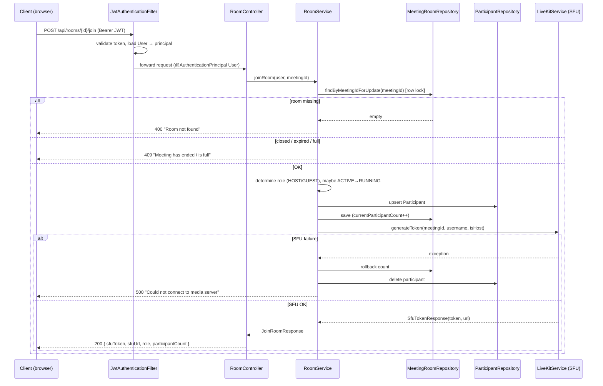
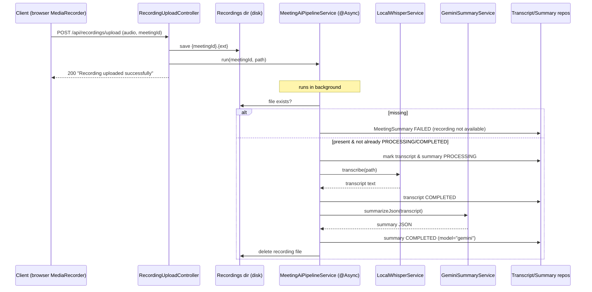

# Controllers Reference

This document describes **every controller** in the video-conferencing backend
(`com.atharva.backend`). It is written for a developer who did **not** write this
code and wants to understand each endpoint and its request → response flow.

There are **6 REST controllers** and **1 WebSocket (STOMP) signaling controller**:

| Controller | Base path / mapping | Type | Auth |
|---|---|---|---|
| `AuthController` | `/api/auth` | REST | Public |
| `AuthTestController` | `/api/test` | REST | Authenticated |
| `RoomController` | `/api/rooms` | REST | Authenticated |
| `MeetingSummaryController` | `/api/meetings/{meetingId}/summary` | REST | Authenticated |
| `RecordingUploadController` | `/api/recordings` | REST | Authenticated |
| `RecordingAdminController` | `/api/admin/recordings` | REST | Authenticated (⚠ no admin role enforced) |
| `SignalingController` | `/app/signal`, `/app/room/{meetingId}/sdp` | **WebSocket / STOMP** | Handshake-level |

---

## Security model (read this first)

All HTTP security rules live in
[`SecurityConfig.java`](../src/main/java/com/atharva/backend/config/SecurityConfig.java).
The relevant rules (`SecurityConfig.java:31-37`):

```java
.authorizeHttpRequests(auth -> auth
    .requestMatchers("/api/auth/**").permitAll()   // public
    .requestMatchers("/ws/**").permitAll()          // WebSocket handshake
    .anyRequest().authenticated()                   // everything else needs a JWT
)
```

Key facts:

- **Session policy is `STATELESS`** (`SecurityConfig.java:30`) — there is no
  server session; every request is authenticated solely from the `Authorization: Bearer <JWT>` header.
- **Only `/api/auth/**` and `/ws/**` are public.** Every other endpoint —
  including `/api/admin/recordings/**` — requires a valid JWT. **There is no role
  check anywhere.** No `@PreAuthorize`, no `@Secured`, and the
  `JwtAuthenticationFilter` builds the authentication with an **empty authority
  list** (`JwtAuthenticationFilter.java:48-50`: `new UsernamePasswordAuthenticationToken(user, null, List.of())`).
  So "authenticated" is the strongest guarantee any protected endpoint has.
- **CSRF is disabled** (stateless API) and **CORS** allows
  `http://localhost:5173`, `http://localhost:3000`, `http://127.0.0.1:5173`
  (`SecurityConfig.java:46-50`).

### How authentication actually works

[`JwtAuthenticationFilter`](../src/main/java/com/atharva/backend/auth/JwtAuthenticationFilter.java)
runs once per request (before `UsernamePasswordAuthenticationFilter`):

1. Reads the `Authorization` header. If it is missing or not `Bearer ...`, the
   request continues unauthenticated (and will be rejected by `SecurityConfig`
   if the path is protected) — `JwtAuthenticationFilter.java:35-39`.
2. Validates the token via `JwtService.isTokenValid` (signature + expiry) —
   `JwtAuthenticationFilter.java:44`.
3. Extracts the user id (the JWT `subject`), loads the `User` from the DB, and
   places the **`User` entity itself** as the Spring Security principal —
   `JwtAuthenticationFilter.java:45-51`.

Because the principal is the `User` entity, controllers can inject it directly
with `@AuthenticationPrincipal User user` (used throughout `RoomController`).

The JWT is an HS256 token whose `subject` is the user id and which carries a
`username` claim; default lifetime is 1 hour (`JwtService.java:31-46`).

### Error responses (global)

All controllers share one exception handler,
[`GlobalExceptionHandler`](../src/main/java/com/atharva/backend/Exception/GlobalExceptionHandler.java)
(`@RestControllerAdvice`). Thrown exceptions map to HTTP status codes as follows.
The response **body is the raw exception message string** (not JSON):

| Exception thrown | HTTP status | Typical trigger |
|---|---|---|
| `IllegalArgumentException` | **400 Bad Request** | "Username already taken", "Invalid credentials", "Room not found" |
| `IllegalStateException` | **409 Conflict** | "This meeting has ended/expired", "Meeting is full" |
| `SecurityException` | **403 Forbidden** | "Only the host can close this room." |
| `RuntimeException` (any other) | **500 Internal Server Error** | SFU token failure, etc. |

> Note: a missing/invalid JWT on a protected route is rejected by Spring Security
> *before* reaching a controller, so it returns a **401/403** from the security
> filter chain, not from `GlobalExceptionHandler`.

---

## 1. AuthController — signup & login

**Purpose:** Public entry point for account creation and login. Issues JWTs.
On success both endpoints return a token plus basic profile info.

**Base path:** `/api/auth`
([`AuthController.java`](../src/main/java/com/atharva/backend/auth/AuthController.java))

| Method | Path | Auth | Role | Request body | Response | Services |
|---|---|---|---|---|---|---|
| POST | `/api/auth/signup` | Public | — | `SignupRequest` | `200 AuthResponse` | `AuthService.signup` |
| POST | `/api/auth/login` | Public | — | `LoginRequest` | `200 AuthResponse` | `AuthService.login` |

### Flow: signup (`AuthController.java:19-22` → `AuthService.signup`, `AuthService.java:21-39`)

1. Controller receives `SignupRequest` and calls `authService.signup(req)`.
2. Service checks uniqueness via `UserRepository.existsByUsername` /
   `existsByEmail`. If either is taken → throws `IllegalArgumentException`
   → **400** (`AuthService.java:22-27`).
3. Builds a `User`, BCrypt-hashes the password
   (`passwordEncoder.encode`, `AuthService.java:33`), and saves it.
4. Generates a JWT (`JwtService.generateToken(userId, username)`).
5. Returns `AuthResponse(token, username, displayName)` → controller wraps in `200 OK`.

### Flow: login (`AuthController.java:24-28` → `AuthService.login`, `AuthService.java:42-54`)

1. Service looks up the user **by username, then falls back to email**
   (`findByUsername(...).or(() -> findByEmail(...))`) — so the `username` field
   of `LoginRequest` accepts either. Not found → `IllegalArgumentException`
   ("Invalid credentials") → **400**.
2. `passwordEncoder.matches(raw, hash)`; mismatch → same "Invalid credentials" 400.
3. On success, generates a JWT and returns `AuthResponse`.

> ⚠ `AuthController.login` contains a leftover `System.out.println(req.getUsername())`
> (`AuthController.java:26`) that logs the username to stdout — harmless but noise.

### DTOs

`SignupRequest` ([dto/SignupRequest.java](../src/main/java/com/atharva/backend/auth/dto/SignupRequest.java)):

| Field | Type |
|---|---|
| `username` | String |
| `email` | String |
| `password` | String (plaintext in; hashed server-side) |
| `displayName` | String |

`LoginRequest` ([dto/LoginRequest.java](../src/main/java/com/atharva/backend/auth/dto/LoginRequest.java)):

| Field | Type |
|---|---|
| `username` | String (accepts username **or** email) |
| `password` | String |

`AuthResponse` ([dto/AuthResponse.java](../src/main/java/com/atharva/backend/auth/dto/AuthResponse.java)):

| Field | Type | Notes |
|---|---|---|
| `token` | String | HS256 JWT, sub = userId, 1h default expiry |
| `username` | String | |
| `displayName` | String | |

### Related entity: `User`

[`User.java`](../src/main/java/com/atharva/backend/auth/entity/User.java) (table `users`):
`id` (PK), `username` (unique, ≤50), `email` (unique), `passwordHash`,
`displayName` (≤100), `createdAt`.

---

## 2. AuthTestController — JWT debug endpoint

**Purpose:** Diagnostic endpoint to verify JWT authentication is wired correctly.
Echoes back whether the supplied token is valid and what the security context contains.

**Base path:** `/api/test`
([`AuthTestController.java`](../src/main/java/com/atharva/backend/auth/AuthTestController.java))

| Method | Path | Auth | Role | Params | Response | Services |
|---|---|---|---|---|---|---|
| GET | `/api/test/auth` | Authenticated* | — | `Authorization` header (optional) | `200` JSON map | `JwtService.isTokenValid`, `extractUserId` |

\* The path is **not** under `/api/auth/**`, so `SecurityConfig` requires a valid
JWT to reach it. The handler then *additionally* inspects the header itself and
returns a JSON map describing the auth state (`authenticated`, `userId`,
`principal`, `message`) — `AuthTestController.java:26-68`. It always returns
`200 OK`; the boolean `authenticated` field carries the actual result.

This is a development/debug helper and should be removed or locked down in production.

---

## 3. RoomController — meeting lifecycle ⭐ (most important)

**Purpose:** The core of the app. Lets an authenticated user create a meeting
room (becoming HOST), join/leave rooms (receiving a LiveKit SFU token on join),
close rooms (host only), and fetch their meeting history.

**Base path:** `/api/rooms`
([`RoomController.java`](../src/main/java/com/atharva/backend/room/RoomController.java)).
**Every endpoint is authenticated** and injects the caller via
`@AuthenticationPrincipal User user`.

| Method | Path | Auth | Role | Request | Response | Services |
|---|---|---|---|---|---|---|
| POST | `/api/rooms/create` | Yes | any user | `CreateRoomRequest` | `200 RoomResponse` | `RoomService.createRoom` |
| POST | `/api/rooms/{meetingId}/join` | Yes | any user | path `meetingId` | `200 JoinRoomResponse` | `RoomService.joinRoom` → `LiveKitService.generateToken` |
| POST | `/api/rooms/{meetingId}/leave` | Yes | any user | path `meetingId` | `200` empty | `RoomService.leaveRoom` |
| POST | `/api/rooms/{meetingId}/close` | Yes | **host only** (enforced in service) | path `meetingId` | `200` empty | `RoomService.closeRoom` |
| GET | `/api/rooms/history` | Yes | any user | — | `200 List<MeetingHistoryItemDto>` | `RoomService.getMeetingHistory` |

> Note: the mapping for history is `@GetMapping("history")` (no leading slash),
> which Spring resolves to `/api/rooms/history` — `RoomController.java:56`.
> "Host only" on `close` is **not** a Spring role — it is a runtime ownership
> check inside the service (`SecurityException` → 403).

### Endpoint flows

**`createRoom`** (`RoomController.java:22-28` → `RoomService.createRoom`, `RoomService.java:79-113`):

1. Generate a Zoom-style id `xxx-xxxx-xxx` from a UUID; retry until unique
   (`generateMeetingId`, `existsByMeetingId`).
2. Build a `MeetingRoom` with `status = ACTIVE`, the caller as `host`,
   `maxParticipants` (defaults to 100 if `≤ 0`), and `expiresAt = now + 4h`.
3. Save and return a `RoomResponse`.

**`joinRoom`** is the richest flow (`RoomController.java:30-36` →
`RoomService.joinRoom`, `RoomService.java:123-215`). It is `@Transactional` and
`@Retryable` on `CannotAcquireLockException` (3 attempts, exponential backoff)
because it takes a **row lock** (`findByMeetingIdForUpdate`) to safely increment
the participant count:

1. Load the room **FOR UPDATE** (pessimistic lock). Missing →
   `IllegalArgumentException` ("Room not found") → **400**.
2. Reject if `CLOSED`/`EXPIRED`, or lazily expire if `expiresAt` has passed →
   `IllegalStateException` → **409**.
3. Reject if `currentParticipantCount >= maxParticipants` → "Meeting is full" → **409**.
4. Determine role: caller is `HOST` if they own the room, else `GUEST`.
5. If the host is joining an `ACTIVE` room, transition it to `RUNNING`.
6. Upsert a `Participant` row (idempotent via `findByMeetingRoomAndUser`),
   then `currentParticipantCount++`.
7. Request a LiveKit token from `LiveKitService.generateToken(meetingId,
   username, isHost)`. **If the SFU call fails**, the service rolls back the
   count and deletes the participant, then throws `RuntimeException`
   ("Could not connect to media server") → **500** (`RoomService.java:193-204`).
8. Return `JoinRoomResponse` containing the SFU token + URL + role + count.

**`leaveRoom`** (`RoomService.java:220-238`): finds the participant, stamps
`leftAt`, decrements the count (floored at 0). Silently does nothing if the room
or participation does not exist. Returns `200` empty.

**`closeRoom`** (`RoomService.java:243-263`): loads the room; if the caller is
**not** the host → `SecurityException` → **403**. Otherwise sets `status = CLOSED`,
stamps `closedAt`, and marks all participants left
(`participantRepository.markAllAsLeft`). The AI summary pipeline is **not**
triggered here — it is triggered by the recording upload (see controller #5).

**`meetingHistory`** (`RoomService.java:266-288`): for each past `Participant`
of the user, builds a `MeetingHistoryItemDto`, enriching it with the AI summary
status looked up from `MeetingSummaryRepository` (`NOT_AVAILABLE` if none).

### Sequence diagram — `POST /api/rooms/{meetingId}/join`



### DTOs

`CreateRoomRequest` ([dto](../src/main/java/com/atharva/backend/room/dto/CreateRoomRequest.java)):
`title` (String, defaults to "Meeting"), `maxParticipants` (int, defaults to 100 if `≤ 0`).

`RoomResponse` ([dto](../src/main/java/com/atharva/backend/room/dto/RoomResponse.java)):
`meetingId`, `title`, `status`, `maxParticipants`, `expiresAt`.

`JoinRoomResponse` ([dto](../src/main/java/com/atharva/backend/room/dto/JoinRoomResponse.java)):

| Field | Notes |
|---|---|
| `meetingId` | |
| `sfuToken` | LiveKit access token (client uses this to connect to media server) |
| `sfuUrl` | LiveKit server URL |
| `role` | `HOST` or `GUEST` |
| `participantCount` | current count after this join |

`MeetingHistoryItemDto` ([dto](../src/main/java/com/atharva/backend/room/dto/MeetingHistoryItemDto.java)):
`meetingId`, `title`, `role`, `roomStatus`, `joinedAt`, `leftAt`, `closedAt`,
`summaryStatus` (`PENDING|PROCESSING|COMPLETED|FAILED|NOT_AVAILABLE`).

### Related entities

`MeetingRoom` ([entity](../src/main/java/com/atharva/backend/room/entity/MeetingRoom.java),
table `meeting_rooms`): `id`, `meetingId` (unique), `title`, `host` (→ `User`),
`status` (`RoomStatus`: ACTIVE/RUNNING/EXPIRED/CLOSED), `maxParticipants`,
`currentParticipantCount`, `expiresAt`, `createdAt`, `closedAt`.

`Participant` ([entity](../src/main/java/com/atharva/backend/room/entity/Participant.java),
table `participants`): `id`, `meetingRoom` (→ `MeetingRoom`), `user` (→ `User`),
`role` (`ParticipantRole`: HOST/CO_HOST/GUEST), `joinedAt`, `leftAt`, `sessionId`.

---

## 4. MeetingSummaryController — AI meeting summary retrieval

**Purpose:** Read-only access to the AI-generated meeting summary and its
processing status. The summary itself is produced asynchronously by the AI
pipeline (see controller #5).

**Base path:** `/api/meetings/{meetingId}/summary` (authenticated)
([`MeetingSummaryController.java`](../src/main/java/com/atharva/backend/ai/controller/MeetingSummaryController.java))

| Method | Path | Auth | Request | Response | Services |
|---|---|---|---|---|---|
| GET | `/api/meetings/{meetingId}/summary/status` | Yes | path `meetingId` | `200 {status, message}` | `MeetingSummaryRepository.findByMeetingId` |
| GET | `/api/meetings/{meetingId}/summary` | Yes | path `meetingId` | `200` summary JSON / `400` / `500` | `MeetingSummaryRepository.findByMeetingId` |

### Flows

- **`/status`** (`MeetingSummaryController.java:20-25`): loads the
  `MeetingSummary` row. If none exists, returns the literal
  `{"status":"PENDING","message":"Not started"}`. Otherwise returns the row's
  status name and either `"OK"` or the stored `errorMessage`. The `Status` is a
  small inner `record Status(String status, String message)`.
- **`GET` (no suffix)** (`MeetingSummaryController.java:27-32`): loads the row
  with `orElseThrow()`. **If the row does not exist, the `NoSuchElementException`
  is unhandled by name and falls through to `GlobalExceptionHandler`'s
  `RuntimeException` branch → 500.** If the status is not `COMPLETED`, returns
  `400` with `{"error":"Summary not ready"}`. Otherwise returns the raw
  `summaryJson` string with `200`.

### Related entity: `MeetingSummary`

[`MeetingSummary.java`](../src/main/java/com/atharva/backend/ai/model/MeetingSummary.java)
(table `meeting_summaries`, unique on `meeting_id`):

| Field | Type | Notes |
|---|---|---|
| `id` | Long | PK |
| `meetingId` | String(64) | unique |
| `status` | `JobStatus` | PENDING / PROCESSING / COMPLETED / FAILED |
| `summaryJson` | LONGTEXT | the AI summary payload returned by `GET` |
| `model` | String(128) | e.g. `"gemini"` |
| `errorMessage` | String(1000) | populated on FAILED |
| `createdAt` | Instant | |

---

## 5. RecordingUploadController — upload audio & kick off AI pipeline

**Purpose:** Receives the browser-recorded meeting audio (multipart upload),
persists it to the configured recordings directory, and triggers the
asynchronous transcription → summarization pipeline.

**Base path:** `/api/recordings` (authenticated)
([`RecordingUploadController.java`](../src/main/java/com/atharva/backend/recording/RecordingUploadController.java))

| Method | Path | Auth | Request (multipart) | Response | Services |
|---|---|---|---|---|---|
| POST | `/api/recordings/upload` | Yes | `audio` (file), `meetingId` (string) | `200 "Recording uploaded successfully"` / `500 "Upload failed: ..."` | `MeetingAiPipelineService.run` |

### Flow (`RecordingUploadController.java:30-58`)

1. Logs the upload (name + size in MB).
2. Ensures the output directory exists (`recording.output.dir` property,
   injected via `@Value` — `RecordingUploadController.java:21-22`).
3. Saves the file as `{meetingId}.{ext}` (extension taken from the original
   filename, defaulting to `webm`), overwriting any existing file with
   `REPLACE_EXISTING`.
4. Calls `aiPipelineService.run(meetingId, finalFilePath)` — this is `@Async`,
   so the HTTP response returns immediately while the pipeline runs in the
   background.
5. On `IOException` returns `500` with the message; otherwise `200` with a plain
   text body.

### What the async pipeline does (`MeetingAiPipelineService.run`, [service](../src/main/java/com/atharva/backend/ai/service/MeetingAiPipelineService.java))



Key details from `MeetingAiPipelineService.java:34-129`:

- **Idempotent**: if the summary is already `PROCESSING` or `COMPLETED` it skips
  (`:73-76`).
- If the audio file is missing, it writes a `FAILED` summary with a helpful
  "LiveKit Cloud free tier does not support recording" message (`:39-56`).
- On any exception during transcription/summarization, both rows are marked
  `FAILED` with a truncated error message, and the recording file is deleted
  anyway to save space (`:111-128`).
- The produced `summaryJson` is what `MeetingSummaryController GET` later serves.

Cross-reference: room closing (`RoomController close`) does **not** start this
pipeline — the upload is the trigger.

---

## 6. RecordingAdminController — recording maintenance

**Purpose:** Operator/maintenance endpoints to wipe all recording files and to
report disk usage of the recordings directory.

**Base path:** `/api/admin/recordings`
([`RecordingAdminController.java`](../src/main/java/com/atharva/backend/ai/controller/RecordingAdminController.java))

| Method | Path | Auth | Role | Response | Services |
|---|---|---|---|---|---|
| POST | `/api/admin/recordings/cleanup` | Yes | ⚠ none enforced | `200 {message, deletedFiles}` | `RecordingCleanupService.cleanupAllRecordings` |
| GET | `/api/admin/recordings/disk-usage` | Yes | ⚠ none enforced | `200 {bytes, megabytes}` | `RecordingCleanupService.getRecordingsDiskUsage` |

> ⚠ **Security gap:** the class Javadoc says "In production, these should be
> protected with admin-only authentication" (`RecordingAdminController.java:10-13`),
> but **no admin role is actually enforced**. Per `SecurityConfig`, `/api/admin/**`
> falls under `.anyRequest().authenticated()`, so **any logged-in user** can
> delete every recording. There is no `@PreAuthorize` and JWTs carry no
> authorities. This should be locked down before production.

### Flows

- **`/cleanup`** (`RecordingAdminController.java:29-37`): calls
  `cleanupAllRecordings()`, which deletes every `*.{ogg,mp3,wav,m4a}` file in the
  recordings directory **regardless of age** (`RecordingCleanupService.java:73-101`),
  and returns the count. (A separate `@Scheduled` job at 03:00 daily deletes only
  files older than 24h — `RecordingCleanupService.java:30-67` — but that is not an
  endpoint.)
- **`/disk-usage`** (`RecordingAdminController.java:42-50`): sums the size of all
  regular files in the directory and returns both raw bytes and a formatted MB string.

---

## 7. SignalingController — WebRTC signaling (WebSocket / STOMP, **not REST**) 📡

> **This is not a REST controller.** It is a Spring `@Controller` with STOMP
> `@MessageMapping` handlers used for **WebRTC signaling** over the WebSocket
> connection. There is no HTTP method, no path under `/api`, and no
> `GlobalExceptionHandler` involvement. For the full transport/handshake details
> see **[websocket-signaling.md](./websocket-signaling.md)**.

**Purpose:** Relays WebRTC signaling messages (SDP offers/answers, ICE
candidates, chat, hand-raise, etc.) between participants of a meeting — either
privately to one user or broadcast to the whole room.
([`SignalingController.java`](../src/main/java/com/atharva/backend/signaling/SignalingController.java))

**Security:** The WebSocket *handshake* is reached via `/ws/**`, which is
`permitAll()` in `SecurityConfig` ("auth inside handshake" —
`SecurityConfig.java:34`). Authorization for STOMP frames is therefore handled
at the WebSocket layer, not by the HTTP security chain — see the signaling doc.

| STOMP destination (client SEND) | Handler | Routing | Delivers to |
|---|---|---|---|
| `/app/signal` | `handleSignal` | private if `targetUsername` set, else broadcast | `/user/queue/signal` (private) **or** `/topic/room-{meetingId}` (broadcast) |
| `/app/room/{meetingId}/sdp` | `handleSdp` | private only (drops if no target) | `/user/queue/signal` |

### Flow

- **`handleSignal`** (`SignalingController.java:27-52`): inspects the incoming
  `SignalMessage`. If `targetUsername` is set → `convertAndSendToUser(target,
  "/queue/signal", message)` (private). Otherwise →
  `convertAndSend("/topic/room-" + meetingId, message)` (broadcast to all room
  subscribers). Uses Spring's `SimpMessagingTemplate`.
- **`handleSdp`** (`SignalingController.java:59-76`): a dedicated SDP
  offer/answer relay for the P2P-fallback case. It stamps the path's
  `meetingId` onto the message and **requires** a `targetUsername` — if absent it
  logs a warning and drops the message. Then forwards privately.

### DTOs

`SignalMessage` ([dto](../src/main/java/com/atharva/backend/signaling/dto/SignalMessage.java)):

| Field | Type | Notes |
|---|---|---|
| `type` | `SignalType` | enum (see below) |
| `meetingId` | String | room id |
| `senderUsername` | String | who sent it |
| `targetUsername` | String | `null`/empty ⇒ broadcast to room; set ⇒ private |
| `payload` | Object | SDP / ICE candidate / chat text / etc. |

`SignalType` ([dto](../src/main/java/com/atharva/backend/signaling/dto/SignalType.java)) values:
`OFFER`, `ANSWER`, `ICE_CANDIDATE`, `USER_JOINED`, `USER_LEFT`, `HAND_RAISED`,
`HAND_LOWERED`, `CHAT_MESSAGE`, `SCREEN_SHARE_STARTED`, `SCREEN_SHARE_STOPPED`,
`MUTE_REQUEST`, `ROOM_CLOSED`.

---

## Appendix — quick endpoint index

| # | Method | Path | Public? |
|---|---|---|---|
| 1 | POST | `/api/auth/signup` | ✅ public |
| 2 | POST | `/api/auth/login` | ✅ public |
| 3 | GET | `/api/test/auth` | 🔒 auth |
| 4 | POST | `/api/rooms/create` | 🔒 auth |
| 5 | POST | `/api/rooms/{meetingId}/join` | 🔒 auth |
| 6 | POST | `/api/rooms/{meetingId}/leave` | 🔒 auth |
| 7 | POST | `/api/rooms/{meetingId}/close` | 🔒 auth (host only in service) |
| 8 | GET | `/api/rooms/history` | 🔒 auth |
| 9 | GET | `/api/meetings/{meetingId}/summary/status` | 🔒 auth |
| 10 | GET | `/api/meetings/{meetingId}/summary` | 🔒 auth |
| 11 | POST | `/api/recordings/upload` | 🔒 auth |
| 12 | POST | `/api/admin/recordings/cleanup` | 🔒 auth (⚠ no admin role) |
| 13 | GET | `/api/admin/recordings/disk-usage` | 🔒 auth (⚠ no admin role) |
| 14 | STOMP | `/app/signal` | 📡 WebSocket |
| 15 | STOMP | `/app/room/{meetingId}/sdp` | 📡 WebSocket |
