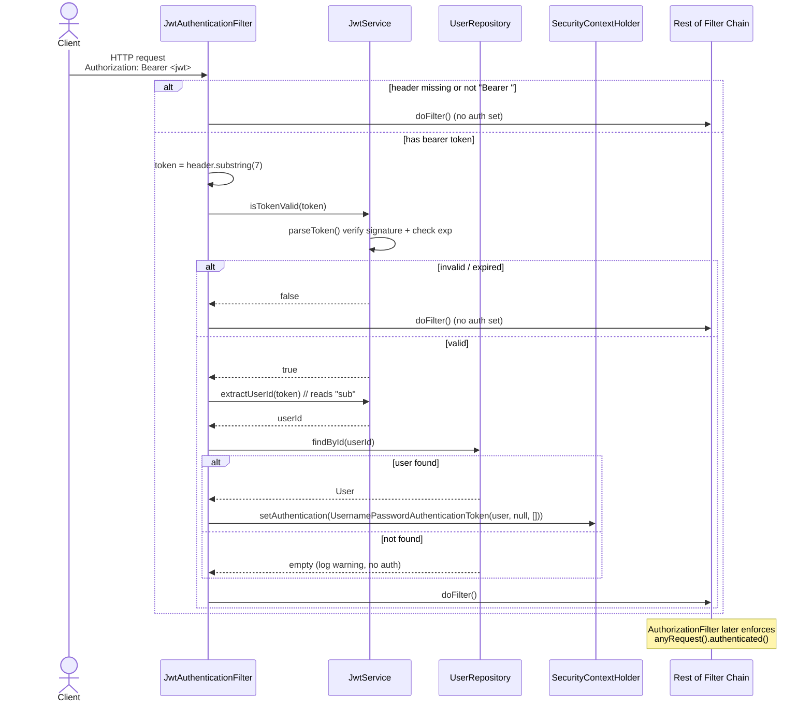

# JWT Implementation

> Companion doc: [`security.md`](./security.md) — how this filter plugs into the Spring
> Security chain and which endpoints it guards.

Two classes do all the JWT work:

| Class | Responsibility | File |
|---|---|---|
| `JwtService` | Generate, parse, and validate tokens | `auth/JwtService.java` |
| `JwtAuthenticationFilter` | Read the header on each request, validate the token, populate the `SecurityContext` | `auth/JwtAuthenticationFilter.java` |

The library is **JJWT** (`io.jsonwebtoken`), and the algorithm is **HS256** (HMAC-SHA256).

---

## 1. `JwtService` — Method by Method

`auth/JwtService.java`

### Construction & configuration (`:17-29`)

```java
private final Key signingKey;
private final long expirationMs;

public JwtService(
        @Value("${app.jwt.secret}") String secret,
        @Value("${app.jwt.expiration-ms:3600000}") long expirationMs) {
    this.signingKey = Keys.hmacShaKeyFor(secret.getBytes());  // :25
    this.expirationMs = expirationMs;                          // :26
}
```

| Field | How it's built | Notes |
|---|---|---|
| `signingKey` | `Keys.hmacShaKeyFor(secret.getBytes())` (`:25`) | HMAC key from the raw secret bytes. Must be **≥ 256 bits (32 bytes)** for HS256, or JJWT throws on key creation. |
| `expirationMs` | injected from `app.jwt.expiration-ms`, default `3600000` (`:22`) | Token lifetime in milliseconds. |

Configuration values are loaded from `src/main/resources/application.properties`:

| Property | Value (current) | Used by |
|---|---|---|
| `app.jwt.secret` | `YourSuperSecretKeyThatIsAtLeast32BytesLong!!` | `JwtService` constructor `:21` |
| `app.jwt.expiration-ms` | `86400000` (24 hours) | `JwtService` constructor `:22` |

> ⚠️ The default in code is `3600000` (1 hour), but `application.properties` **overrides**
> it to `86400000` (24 hours). The constructor logs the effective value at startup
> (`:27-28`).
> ⚠️ The secret is hardcoded in plaintext in `application.properties` — for production it
> should come from an environment variable / secret manager.

### `generateToken(Long userId, String username)` (`:31-46`)

```java
String token = Jwts.builder()
        .subject(String.valueOf(userId))     // :36  → "sub"
        .claim("username", username)          // :37  → custom claim
        .issuedAt(now)                        // :38  → "iat"
        .expiration(expiration)               // :39  → "exp" = now + expirationMs
        .signWith(signingKey)                 // :40  → HS256 signature
        .compact();                           // :41
```

Builds and signs a compact JWT. The **subject (`sub`) is the numeric user ID** — this is
what the filter later reads back to load the user.

### `parseToken(String token)` (`:48-54`)

```java
return Jwts.parser()
        .verifyWith((SecretKey) signingKey)   // :50  verifies signature
        .build()
        .parseSignedClaims(token)             // :52  throws if tampered/expired
        .getPayload();                        // :53  returns Claims
```

Verifies the signature with the signing key and returns the `Claims` payload. Throws
(`SignatureException`, `ExpiredJwtException`, `MalformedJwtException`, …) on any problem.

### `extractUserId(String token)` (`:56-58`)

```java
return Long.parseLong(parseToken(token).getSubject());
```

Parses the token and converts the `sub` claim back to a `Long`.

### `isTokenValid(String token)` (`:60-81`)

```java
Claims claims = parseToken(token);
Date expiration = claims.getExpiration();
boolean isValid = expiration.after(new Date());   // :64  not expired?
return isValid;
```

Returns `true` only if the token parses (valid signature) **and** is not past its `exp`.
It explicitly catches and returns `false` for:

| Exception | Line | Meaning |
|---|---|---|
| `ExpiredJwtException` | `:71-73` | Token's `exp` is in the past |
| `SignatureException` | `:74-76` | Signature doesn't match the key (tampered / wrong secret) |
| any other `Exception` | `:77-80` | Malformed token, etc. |

Because parsing failures are caught and logged, **`isTokenValid` never throws** — it
always returns a boolean.

---

## 2. Token Structure

A JWT has three dot-separated Base64URL parts: `header.payload.signature`.

### Header
Set automatically by JJWT's `signWith(signingKey)`:
```json
{ "alg": "HS256" }
```

### Payload (claims) — built in `generateToken`

| Claim | Standard? | Source | Code |
|---|---|---|---|
| `sub` | standard (subject) | the user's `id` as a string | `:36` |
| `username` | **custom** | the user's `username` | `:37` |
| `iat` | standard (issued-at) | current time | `:38` |
| `exp` | standard (expiration) | `iat + expirationMs` | `:39` |

Example decoded payload:
```json
{
  "sub": "42",
  "username": "atharva",
  "iat": 1718275200,
  "exp": 1718361600
}
```

### Signature
`HMACSHA256( base64url(header) + "." + base64url(payload), signingKey )`.

### Which claims are actually used downstream

| Claim | Read by | Purpose |
|---|---|---|
| `sub` | `extractUserId` (`:56-58`) → filter `:45` | Loads the `User` from the DB |
| `exp` | `isTokenValid` (`:64`) | Expiry check |
| `username` | *(generated but never read back)* | Informational only |

> Note: although `username` is stored as a claim, the filter loads the **real** user
> from the DB by `sub`, so the authenticated principal's username is always the
> authoritative DB value, not the token claim.

---

## 3. `JwtAuthenticationFilter` — Step by Step

`auth/JwtAuthenticationFilter.java`. It extends `OncePerRequestFilter` (`:19`), so it
runs exactly once per request. It is registered in the chain via `addFilterBefore(...)`
— see [`security.md`](./security.md#1-the-filter-chain-securityconfigjava).

`doFilterInternal` (`:29-64`):

1. **Read the header** (`:31`):
   ```java
   String authHeader = request.getHeader("Authorization");
   ```
2. **Bail out if no bearer token** (`:35-39`): if the header is `null` or does not start
   with `"Bearer "`, log and **continue the chain without authenticating**. (Rejection,
   if the endpoint is protected, is done later by Spring's authorization rules — see
   [`security.md`](./security.md#6-authorization-flow-accessing-a-protected-endpoint).)
3. **Extract the raw token** (`:41`):
   ```java
   String token = authHeader.substring(7);   // strip "Bearer "
   ```
4. **Validate** (`:44`): `jwtService.isTokenValid(token)`. If invalid → log a warning,
   set nothing.
5. **Extract the user ID** (`:45`): `jwtService.extractUserId(token)` reads `sub`.
6. **Load the user** (`:46`): `userRepository.findById(userId)`.
   - If absent → log a warning, authenticate nothing (`:54`).
7. **Populate the SecurityContext** (`:48-51`):
   ```java
   var authToken = new UsernamePasswordAuthenticationToken(
           user, null, List.of());   // principal = User entity, no authorities
   SecurityContextHolder.getContext().setAuthentication(authToken);
   ```
   The authenticated **principal is the full `User` entity**, credentials are `null`,
   and the authorities list is **empty** (no roles — see
   [`security.md`](./security.md#4-where-roles--authorities-come-from)).
8. **Exceptions are swallowed** (`:59-61`): any error logs and falls through —
   the request is never aborted by the filter itself.
9. **Always continue the chain** (`:63`): `filterChain.doFilter(request, response)`.

> Design summary: the filter is **non-blocking**. It either adds an authentication to
> the context or leaves it empty; it never returns an error itself.

---

## 4. Sequence Diagram — A Request Through the Filter



---

## 5. Reusable Pattern — Reproducing JWT Auth in Another Spring Boot Project

To replicate this exact setup in a new project, you need **four moving parts**:

### a) Dependency
JJWT (`io.jsonwebtoken:jjwt-api` + `jjwt-impl` + `jjwt-jackson` runtime).

### b) A `JwtService` (token factory) — copy `auth/JwtService.java`
Remember these methods:

| Method | Keep this signature | Why |
|---|---|---|
| constructor | `@Value("${app.jwt.secret}")`, `@Value("${app.jwt.expiration-ms:...}")` → `Keys.hmacShaKeyFor(secret.getBytes())` | Loads config, builds the HMAC key (secret ≥ 32 bytes!) |
| `generateToken(...)` | `Jwts.builder().subject(...).claim(...).issuedAt(...).expiration(...).signWith(key).compact()` | Mints the token; put the user id in `sub` |
| `parseToken(...)` | `Jwts.parser().verifyWith(key).build().parseSignedClaims(t).getPayload()` | Single place that verifies the signature |
| `extractUserId(...)` | `Long.parseLong(parseToken(t).getSubject())` | Pull identity out of `sub` |
| `isTokenValid(...)` | parse + `getExpiration().after(now)`, catch JJWT exceptions → `false` | Never throws; returns a clean boolean |

### c) A `OncePerRequestFilter` — copy `auth/JwtAuthenticationFilter.java`
The reusable skeleton:
```java
String authHeader = request.getHeader("Authorization");
if (authHeader == null || !authHeader.startsWith("Bearer ")) { chain.doFilter(...); return; }
String token = authHeader.substring(7);
if (jwtService.isTokenValid(token)) {
    var id = jwtService.extractUserId(token);
    userRepository.findById(id).ifPresent(user -> {
        var auth = new UsernamePasswordAuthenticationToken(user, null, /* authorities */ List.of());
        SecurityContextHolder.getContext().setAuthentication(auth);
    });
}
chain.doFilter(request, response);   // always continue
```

### d) Security config wiring — copy `config/SecurityConfig.java`
The three lines that matter:
```java
.sessionManagement(sm -> sm.sessionCreationPolicy(SessionCreationPolicy.STATELESS))
.authorizeHttpRequests(a -> a.requestMatchers("/api/auth/**").permitAll().anyRequest().authenticated())
.addFilterBefore(jwtFilter, UsernamePasswordAuthenticationFilter.class);
```
Plus a `BCryptPasswordEncoder` bean and (if cross-origin) a CORS source.

### Checklist to remember
1. `JwtService` with `generateToken` / `isTokenValid` / `extractUserId`.
2. A `OncePerRequestFilter` that sets `SecurityContextHolder` and **never blocks**.
3. `STATELESS` session + `permitAll` on auth endpoints + `addFilterBefore(...)`.
4. `app.jwt.secret` (≥ 32 bytes) and `app.jwt.expiration-ms` in properties.
5. To add roles: pass real authorities into the `UsernamePasswordAuthenticationToken`
   instead of `List.of()`.

---

## File Reference Map

| Concern | File |
|---|---|
| Token generation / parsing / validation | `auth/JwtService.java` |
| Per-request header parsing + context setup | `auth/JwtAuthenticationFilter.java` |
| Where the filter is registered + endpoint rules | `config/SecurityConfig.java` → see [`security.md`](./security.md) |
| Secret & expiry properties | `src/main/resources/application.properties` |
| Login/signup that calls `generateToken` | `auth/AuthService.java` → see [`security.md`](./security.md#5-authentication-flow-login) |
