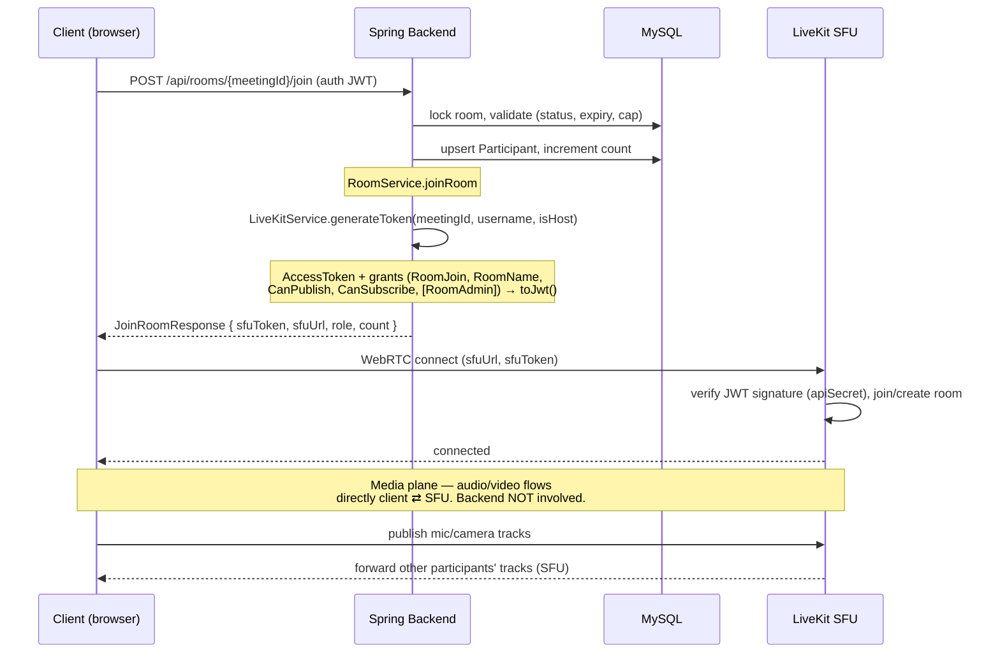

# LiveKit SFU Integration

This document explains how the Spring Boot backend integrates with **LiveKit** for
real-time audio/video, and — most importantly — **where the media data actually
flows**. If you are confused about "how data is transferred," read the
[Data-Transfer Reality](#data-transfer-reality) section first: the short answer is
*the audio/video never touches this Spring backend*.

Written for someone who did **not** write this code.

---

## 1. What is LiveKit and the SFU model?

LiveKit is an open-source real-time media server built on **WebRTC**. It uses the
**SFU (Selective Forwarding Unit)** model: instead of every participant sending their
camera/mic stream to every other participant (a mesh, which explodes with N²
connections), each participant sends *one* upstream to the LiveKit server, and the
server **selectively forwards** those streams down to the other participants. The SFU
does not decode/re-encode media (that would be an MCU); it just routes packets, which
keeps it cheap and low-latency while scaling to many participants per room.

### How THIS app uses LiveKit

This backend is **only the control plane**. It does three things and nothing more:

| Responsibility | Where in code |
|---|---|
| Mint signed JWT access tokens that authorize a client to join a LiveKit room | `LiveKitService.generateToken` — `src/main/java/com/atharva/backend/sfu/LiveKitService.java:37` |
| Start/stop server-side recording (Egress) | `LiveKitRecordingServiceImpl` — `src/main/java/com/atharva/backend/sfu/LiveKitRecordingServiceImpl.java:62` |
| Persist room/participant metadata in MySQL | `RoomService` — `src/main/java/com/atharva/backend/room/RoomService.java` |

The **actual audio/video media flows through the LiveKit server**, directly between the
browser clients and the SFU. It is confirmed by the code: nowhere in
`LiveKitService` or `RoomService` is any media stream read, written, or proxied — the
only thing handed back to the client is a token + a server URL
(`SfuTokenResponse`, `src/main/java/com/atharva/backend/sfu/dto/SfuTokenResponse.java:9`).

> ⚠️ **Note on the current state:** `RoomService.startRecordingAsync`
> (`src/main/java/com/atharva/backend/room/RoomService.java:59`) is currently a **no-op
> stub** — its comment says recording is handled by a browser-side `MediaRecorder` and
> server-side Egress is "disabled due to configuration complexity." The full
> `LiveKitRecordingServiceImpl` (Egress) wiring described in section 6 **exists and is a
> Spring `@Service`**, but `RoomService` does not currently call it. This doc documents
> the Egress implementation as written, and flags this gap explicitly.

---

## 2. Configuration

LiveKit credentials and the server URL are injected from `application.properties`,
which in turn reads them from **environment variables**:

```properties
# src/main/resources/application.properties:14
livekit.api.key=${API_KEY}
livekit.api.secret=${API_SECRET}
livekit.url=${API_URL}

# src/main/resources/application.properties:25
recording.output.dir=D:/Java_Full_Stack/video conferencing/LiveKit/recordings
```

| Property | Env var | Used by | Purpose |
|---|---|---|---|
| `livekit.api.key` | `API_KEY` | `LiveKitService`, `LiveKitRecordingServiceImpl` | LiveKit API key — identifies the project; embedded as the JWT issuer |
| `livekit.api.secret` | `API_SECRET` | both | HMAC secret used to **sign** the JWT and authenticate the Egress REST client |
| `livekit.url` | `API_URL` | both | LiveKit server URL (e.g. `wss://...`). Returned to the client for the WebRTC connection; converted to `http(s)://` for Egress |
| `recording.output.dir` | — (hard-coded host path) | `LiveKitRecordingServiceImpl` | Host directory where the Egress Docker volume mounts `/recordings` |

**Injection style differs between the two services:**

- `LiveKitService` uses **constructor injection** via `@Value`
  (`src/main/java/com/atharva/backend/sfu/LiveKitService.java:19-27`). The values are
  `final` fields.
- `LiveKitRecordingServiceImpl` uses **field injection** via `@Value`
  (`src/main/java/com/atharva/backend/sfu/LiveKitRecordingServiceImpl.java:28-39`).

### SDK dependency

`pom.xml:113-118`:

```xml
<dependency>
    <groupId>io.livekit</groupId>
    <artifactId>livekit-server</artifactId>
    <version>0.6.1</version>
</dependency>
```

This is the **LiveKit Server SDK for Java/Kotlin** (`io.livekit:livekit-server:0.6.1`).
It provides `AccessToken`, the grant classes (`RoomJoin`, `CanPublish`, …),
`EgressServiceClient`, and the generated `LivekitEgress.*` protobuf message types.

---

## 3. Token generation

The single method `LiveKitService.generateToken`
(`src/main/java/com/atharva/backend/sfu/LiveKitService.java:37`) builds and signs the
JWT a client uses to connect to LiveKit.

```java
// LiveKitService.java:37-75 (abridged)
AccessToken token = new AccessToken(apiKey, apiSecret);  // signs with HMAC(secret)
token.setName(identity);
token.setIdentity(identity);

token.addGrants(
    new RoomJoin(true),
    new RoomName(roomName),
    new CanPublish(true),
    new CanSubscribe(true)
    // + new RoomAdmin(true) when isHost == true
);

token.setTtl(TimeUnit.MILLISECONDS.convert(6, TimeUnit.HOURS)); // 6h, in MILLIS
String jwt = token.toJwt();
return new SfuTokenResponse(jwt, livekitUrl);
```

### How the JWT is built and signed

1. `new AccessToken(apiKey, apiSecret)` — the SDK creates a token whose **issuer** is
   `apiKey` and which will be **HMAC-signed** with `apiSecret`.
2. `setName` / `setIdentity` set the participant's display name and unique identity.
3. `addGrants(...)` attaches the permission claims (the `video` grant block).
4. `setTtl(...)` sets the expiry. **TTL is in milliseconds** here — `6 hours` is
   converted to millis explicitly (note the SDK can accept seconds in other versions;
   this code passes millis intentionally, see comment at line 61).
5. `toJwt()` serializes and signs the token, returning a compact JWS string.

The signed JWT is what the client presents to the LiveKit server. LiveKit verifies the
signature with the same `apiSecret` — so **the backend never has to talk to LiveKit to
authorize a join**; the token is self-contained proof.

### Grant structure

Each grant is a distinct SDK class passed into `addGrants(...)`:

| Grant class | Value | Applies to | Meaning |
|---|---|---|---|
| `RoomJoin` | `true` | all | Permission to join a room at all |
| `RoomName` | `roomName` (= `meetingId`) | all | The exact room this token is valid for |
| `CanPublish` | `true` | all | May publish their own mic/camera tracks |
| `CanSubscribe` | `true` | all | May receive other participants' tracks |
| `RoomAdmin` | `true` | **host only** | Admin powers — mute/kick other participants |
| `setIdentity` | `identity` (= username) | all | Unique participant identity within the room |
| `setName` | `identity` | all | Display name |
| TTL | `6 hours` (in ms) | all | Token lifetime |

Hosts get **everything a guest gets plus `RoomAdmin(true)`**
(`LiveKitService.java:44-59`). The `isHost` flag is the only branch.

---

## 4. How rooms and participant identity map to LiveKit

There is **no explicit "create LiveKit room" API call** in this backend. LiveKit rooms
are created lazily by LiveKit itself the moment the first authorized client connects
with a token naming that room. The backend only mints tokens; the room name is the
binding key.

| App concept | LiveKit concept | Derivation |
|---|---|---|
| `MeetingRoom.meetingId` (e.g. `abc-defg-hij`) | LiveKit **room name** | `generateMeetingId()` — `RoomService.java:66`; passed as `roomName` into `generateToken` at `RoomService.java:189` |
| `User.username` | LiveKit participant **identity** | `RoomService.java:190` passes `user.getUsername()` as the identity |
| `ParticipantRole.HOST` vs `GUEST` | `RoomAdmin` grant on/off | `RoomService.java:154-156` decides role; `RoomService.java:191` passes `role == HOST` as `isHost` |

The meeting ID is a Zoom-style `xxx-xxxx-xxx` string generated from a UUID
(`RoomService.java:66-73`) and guaranteed unique via a DB existence check
(`RoomService.java:84-86`). That same string is the LiveKit room name **and** the Egress
room name (section 6), so all three layers — DB, SFU, recording — agree on one key.

### Token-issuing flow in `RoomService.joinRoom`

`RoomService.joinRoom` (`src/main/java/com/atharva/backend/room/RoomService.java:129`)
is the only caller of `generateToken`. In order it:

1. Loads the room with a pessimistic lock (`findByMeetingIdForUpdate`, line 130) and
   validates it is not EXPIRED/CLOSED and not past `expiresAt` (lines 136-144).
2. Enforces the participant cap (lines 147-151).
3. Determines role: HOST if the user is the room's host, else GUEST (lines 154-156).
4. If the host joins an `ACTIVE` room, transitions it to `RUNNING` and *would* start
   recording (lines 159-164 — recording call is the stub).
5. Upserts a `Participant` row (lines 170-178) and increments the count.
6. Calls `liveKitService.generateToken(meetingId, username, isHost)` (lines 188-192).
7. On token failure, **rolls back** the count and deletes the participant
   (lines 194-204) so a media-server outage doesn't leave phantom participants.
8. Returns a `JoinRoomResponse` carrying the token + URL (lines 208-214).

The HTTP entry point is `POST /api/rooms/{meetingId}/join`
(`RoomController.java:30-36`).

---

## 5. Response DTOs

### `SfuTokenResponse`

`src/main/java/com/atharva/backend/sfu/dto/SfuTokenResponse.java:9` — the raw output of
token generation.

| Field | Type | Meaning |
|---|---|---|
| `token` | `String` | The signed LiveKit JWT access token |
| `url` | `String` | The LiveKit server URL (`livekit.url`) the client connects to |

### `JoinRoomResponse`

`src/main/java/com/atharva/backend/room/dto/JoinRoomResponse.java:5` — what the client
actually receives from the join endpoint. It re-exposes the token/URL plus context:

| Field | Source |
|---|---|
| `meetingId` | the room name |
| `sfuToken` | `SfuTokenResponse.token` |
| `sfuUrl` | `SfuTokenResponse.url` |
| `role` | `HOST` / `GUEST` |
| `participantCount` | current count in the room |

---

## 6. Recording / Egress

Server-side recording uses LiveKit's **Egress** API. The contract is two methods
(`src/main/java/com/atharva/backend/sfu/LiveKitRecordingService.java`):

```java
void   startRecording(String meetingId);
String stopAndGetRecordingPath(String meetingId);
```

Implementation: `LiveKitRecordingServiceImpl`
(`src/main/java/com/atharva/backend/sfu/LiveKitRecordingServiceImpl.java`).

### Path coordination (Docker volume)

Egress runs in its own Docker container and writes to a **container path**; a Docker
volume maps that to a **host path** the backend can read
(`LiveKitRecordingServiceImpl.java:15-23`):

| Path kind | Value | Constant/source |
|---|---|---|
| Container dir | `/recordings` | `CONTAINER_RECORDING_DIR` (line 42) |
| Container file | `/recordings/{meetingId}.ogg` | line 75 |
| Host dir | `recording.output.dir` | `@Value` (line 38) |
| Host file | `${recording.output.dir}/{meetingId}.ogg` | line 77 |

Egress is told the **container** path; the backend returns the **host** path for the AI
pipeline to consume.

### Starting a recording — `startRecording` (line 62)

1. **Idempotency guard:** if `egressIds` already has this meeting, skip (lines 65-68).
2. Ensure the host output dir exists (`Files.createDirectories`, line 72).
3. Convert the `ws://`/`wss://` URL to `http://`/`https://` because the Egress client is
   **REST, not WebSocket** (`toHttpUrl`, lines 53-60, called at 79).
4. Create the client: `EgressServiceClient.createClient(httpUrl, apiKey, apiSecret)`
   (lines 83-85).
5. Build the output as an **encoded file**, type **OGG**, at the container path:
   `LivekitEgress.EncodedFileOutput.newBuilder().setFileType(OGG).setFilepath(...)`
   (lines 89-92).
6. Start a **Room Composite Egress** (records the whole room, mixed) via
   `egressClient.startRoomCompositeEgress(...)` (lines 97-109). Arguments, in order:

   | Arg | Value | Meaning |
   |---|---|---|
   | `roomName` | `meetingId` | which LiveKit room to record |
   | `output` | `fileOutput` | the OGG file output |
   | `layout` | `""` | default layout |
   | `preset` | `null` | no encoding preset |
   | `advancedEncoding` | `null` | none |
   | `audioOnly` | `true` | **audio-only** recording |
   | `videoOnly` | `false` | — |
   | `customBaseUrl` | `""` | none |

   `.execute().body()` runs the REST call and returns a `LivekitEgress.EgressInfo`.
7. On success, store the returned **egress ID** keyed by meeting in the in-memory
   `egressIds` map, and the **host file path** in `outputPaths`
   (lines 111-116). The egress ID is LiveKit's handle for this recording job and is
   required later to stop it.
8. **Failure is swallowed, not thrown** (lines 120-126): it logs warnings (Docker not
   running / secret mismatch / server unreachable) and lets the meeting continue without
   recording. The trade-off: a meeting never fails because recording failed, but you can
   silently get no recording (and therefore no AI summary).

### Stopping a recording — `stopAndGetRecordingPath` (line 129)

1. Atomically remove and read back the `egressId` and `outputPath` for the meeting
   (lines 131-132).
2. If there was no active egress, return the best-known path (or a computed default)
   (lines 134-137).
3. Recreate the Egress client and call `egressClient.stopEgress(egressId).execute()`
   (lines 140-146).
4. **Sleep 3 seconds** (lines 153-158) to let Egress flush the file to disk through the
   Docker volume before the AI pipeline reads it.
5. Return the **host-side `.ogg` path** (lines 160-164).

### State held in memory

| Map | Key → Value | Lifetime |
|---|---|---|
| `egressIds` (line 45) | `meetingId` → LiveKit egress ID | added on start, removed on stop |
| `outputPaths` (line 47) | `meetingId` → host file path | added on start, removed on stop |

Both are `ConcurrentHashMap` and **not persisted** — a backend restart loses the
in-memory egress handles (a recording could keep running on LiveKit's side without the
backend knowing its ID).

### Tie-in to the AI pipeline

The `.ogg` host path returned by `stopAndGetRecordingPath` is the input the AI pipeline
consumes: an audio recording is transcribed (Whisper) and summarized (Gemini). The
relevant services live under `src/main/java/com/atharva/backend/ai/` —
`MeetingAiPipelineService`, `LocalWhisperServiceImpl`, `GeminiSummaryServiceImpl`. See
**`docs/ai-pipeline.md`** for the transcription → summarization flow.

> As noted in section 1, in the **current wiring** `RoomService` does not call
> `LiveKitRecordingService`; the comments in `RoomService.startRecordingAsync`
> (line 59) and `closeRoom` (line 256) indicate the AI pipeline is currently triggered
> by a **browser recording upload** rather than by Egress. The Egress code above is the
> server-side alternative.

---

## 7. Data-transfer reality

**This is the part to internalize.** The audio and video of a meeting do **not** pass
through this Spring backend.

- The backend is the **control plane**: authentication, token minting, recording
  control, and persistence (rooms, participants, summaries in MySQL).
- The **media plane** is entirely client ⇄ LiveKit SFU over WebRTC. After the client
  receives `{ sfuToken, sfuUrl }`, it opens a WebRTC connection **directly to the
  LiveKit server** and publishes/subscribes tracks there. The Spring backend is not in
  that path and never sees a single audio/video packet.

```
┌──────────┐   1. POST /join (HTTP)        ┌──────────────────┐
│  Client  │ ───────────────────────────►  │  Spring Backend  │  (control plane)
│ (browser)│ ◄───────────────────────────  │  - mint JWT      │
└────┬─────┘   2. { sfuToken, sfuUrl }      │  - DB persist    │
     │                                       │  - Egress ctrl   │
     │ 3. WebRTC connect (sfuUrl + token)   └────────┬─────────┘
     │                                               │ REST: start/stopEgress
     ▼                                               ▼
┌──────────────────────────────┐            ┌──────────────────┐
│        LiveKit SFU           │ ─────────► │  Egress (Docker) │ → .ogg file
│  (media plane: audio/video)  │            └──────────────────┘
│  forwards tracks between     │
│  participants directly       │
└──────────────────────────────┘
```

So when you ask "how is data transferred?": **signaling/auth data** (the JWT, room
metadata) goes over HTTP to/from this backend; **the actual media** is a separate
WebRTC pipe between each browser and the LiveKit SFU. The only meeting *content* the
backend ever touches is the **recorded `.ogg` file** that Egress writes to disk — and
even that is produced by LiveKit, not by streaming through Spring.

---

## 8. Sequence diagrams

### Joining a room (token mint → direct media)



### Starting and stopping a recording (Egress)

```mermaid
sequenceDiagram
    participant B as Spring Backend
    participant LK as LiveKit Egress (REST)
    participant EG as Egress container (Docker)
    participant FS as Host filesystem
    participant AI as AI pipeline

    Note over B: startRecording(meetingId)
    B->>B: idempotency check (egressIds map)
    B->>FS: Files.createDirectories(outputDir)
    B->>LK: startRoomCompositeEgress(room=meetingId,<br/>OGG → /recordings/{id}.ogg, audioOnly=true)
    LK->>EG: begin recording room
    LK-->>B: EgressInfo { egressId }
    B->>B: egressIds[meetingId]=egressId; outputPaths[meetingId]=hostPath
    EG-->>FS: writes /recordings/{id}.ogg (Docker volume → host)

    Note over B: stopAndGetRecordingPath(meetingId)
    B->>B: egressId = egressIds.remove(meetingId)
    B->>LK: stopEgress(egressId)
    LK->>EG: stop & flush
    B->>B: sleep 3s (let file flush)
    B-->>AI: return host path {outputDir}/{meetingId}.ogg
    Note over AI: transcribe (Whisper) → summarize (Gemini)<br/>see docs/ai-pipeline.md
```

---

## 9. Quick reference

| What | Where |
|---|---|
| Token generation | `LiveKitService.generateToken` — `src/main/java/com/atharva/backend/sfu/LiveKitService.java:37` |
| Token caller (join) | `RoomService.joinRoom` — `src/main/java/com/atharva/backend/room/RoomService.java:188` |
| Join endpoint | `RoomController` — `src/main/java/com/atharva/backend/room/RoomController.java:30` |
| Start recording | `LiveKitRecordingServiceImpl.startRecording` — `src/main/java/com/atharva/backend/sfu/LiveKitRecordingServiceImpl.java:62` |
| Stop recording | `LiveKitRecordingServiceImpl.stopAndGetRecordingPath` — `src/main/java/com/atharva/backend/sfu/LiveKitRecordingServiceImpl.java:129` |
| Token response DTO | `SfuTokenResponse` — `src/main/java/com/atharva/backend/sfu/dto/SfuTokenResponse.java:9` |
| Config properties | `src/main/resources/application.properties:14` |
| SDK dependency | `io.livekit:livekit-server:0.6.1` — `pom.xml:113` |
| AI pipeline | `docs/ai-pipeline.md` |
