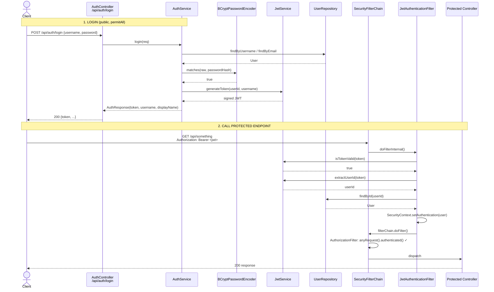

# Spring Security Configuration

> Companion doc: [`jwt.md`](./jwt.md) — token internals (generation, parsing, validation).

This backend is a **stateless JWT-secured REST API**. There are no sessions, no
server-side login state, and no CSRF tokens. Every protected request must carry a
`Authorization: Bearer <jwt>` header, which is validated on each request by a custom
filter.

All security wiring lives in a single class:
`src/main/java/com/atharva/backend/config/SecurityConfig.java`.

---

## 1. The Filter Chain (`SecurityConfig.java`)

The single `SecurityFilterChain` bean is defined at
`config/SecurityConfig.java:25-41`:

```java
http
    .csrf(csrf -> csrf.disable())                                         // line 28
    .cors(cors -> cors.configurationSource(corsConfigurationSource()))    // line 29
    .sessionManagement(sm -> sm.sessionCreationPolicy(STATELESS))         // line 30
    .authorizeHttpRequests(auth -> auth
        .requestMatchers("/api/auth/**").permitAll()                      // line 33
        .requestMatchers("/ws/**").permitAll()                            // line 34
        .anyRequest().authenticated()                                     // line 36
    )
    .addFilterBefore(jwtFilter, UsernamePasswordAuthenticationFilter.class); // line 38
```

### What each line does

| Setting | Code | Effect |
|---|---|---|
| **CSRF** | `csrf.disable()` (`:28`) | Disabled. Safe here because the API is stateless and uses bearer tokens, not cookies. There is no CSRF-vulnerable session. |
| **CORS** | `cors.configurationSource(...)` (`:29`) | Delegates to the `corsConfigurationSource()` bean (see §2). |
| **Session** | `SessionCreationPolicy.STATELESS` (`:30`) | Spring creates/uses **no** `HttpSession`. The `SecurityContext` is rebuilt from the JWT on every request and discarded after. |
| **Authorization rules** | `authorizeHttpRequests(...)` (`:31-37`) | See the matcher table below. |
| **Custom filter** | `addFilterBefore(jwtFilter, …)` (`:38`) | Inserts the [`JwtAuthenticationFilter`](#3-jwtauthenticationfilter-in-the-chain) **before** the username/password filter. |

### Endpoint authorization rules (quoted exactly)

| Matcher | Rule | Meaning |
|---|---|---|
| `.requestMatchers("/api/auth/**").permitAll()` | `permitAll` | `/api/auth/login`, `/api/auth/signup` — open. No token needed (you can't have a token before you log in). |
| `.requestMatchers("/ws/**").permitAll()` | `permitAll` | WebSocket upgrade endpoint is open at the HTTP layer. Auth happens **inside the STOMP handshake** — see §7. |
| `.anyRequest().authenticated()` | `authenticated` | **Everything else** requires a valid authenticated principal in the `SecurityContext`, which only the JWT filter can supply. |

> ⚠️ Note: the chain has **no exception handling / entry-point** configured.
> Unauthenticated requests to protected endpoints fall back to Spring's default
> behavior (a `403`/`401` from `AuthorizationFilter`), not a custom JSON error.

---

## 2. CORS Configuration

Defined in the `corsConfigurationSource()` bean at `config/SecurityConfig.java:43-59`:

| Property | Value | Source |
|---|---|---|
| Allowed origins | `http://localhost:5173`, `http://localhost:3000`, `http://127.0.0.1:5173` | `:46-50` |
| Allowed methods | `GET, POST, PUT, DELETE, OPTIONS` | `:51` |
| Allowed headers | `*` (all) | `:52` |
| Allow credentials | `true` | `:53` |
| Max age | `3600` seconds | `:54` |
| Path | Registered for `/**` | `:57` |

The allowed origins are the Vite dev server (`5173`) and an alternative port (`3000`).
`allowCredentials(true)` is required because the frontend sends the `Authorization`
header cross-origin.

---

## 3. Password Encoder & Authentication "Provider"

```java
@Bean
public PasswordEncoder passwordEncoder() {
    return new BCryptPasswordEncoder();   // config/SecurityConfig.java:61-64
}
```

The password encoder is **BCrypt**. There is **no** `AuthenticationManager`,
`UserDetailsService`, or `AuthenticationProvider` bean in this project.

> 🔑 **Key architectural decision:** authentication is *not* done through Spring's
> `AuthenticationManager`/`DaoAuthenticationProvider` machinery. Instead,
> [`AuthService`](#5-authentication-flow-login) verifies the password **manually** with
> `passwordEncoder.matches(...)`. The encoder bean exists only so `AuthService` can
> hash on signup and compare on login.

---

## 4. Where Roles / Authorities Come From

**There are no roles in this system.**

- The `User` entity (`auth/entity/User.java:12-32`) has fields `id`, `username`,
  `email`, `passwordHash`, `displayName`, `createdAt` — **no role/authority column.**
- When the JWT filter authenticates a request, it builds the token with an **empty
  authority list**:

  ```java
  var authToken = new UsernamePasswordAuthenticationToken(
          user, null, List.of() // Add roles/authorities here if needed
  );
  ```
  — `auth/JwtAuthenticationFilter.java:48-50`

Because the authority list is `List.of()` (empty), every authenticated user has the
same access. Authorization is binary: **you have a valid JWT (authenticated) or you
don't**. There is no `.hasRole(...)` / `@PreAuthorize` usage anywhere in the chain.

> To add roles later: add a role field to `User`, then map it to
> `SimpleGrantedAuthority` instances in the `List.of(...)` argument at
> `JwtAuthenticationFilter.java:49`.

---

## 5. Authentication Flow (Login)

Entry point: `AuthController.login` → `AuthService.login`.

`AuthController` (`auth/AuthController.java:24-28`):
```java
@PostMapping("/login")
public ResponseEntity<AuthResponse> login(@RequestBody LoginRequest req) { ... }
```

`AuthService.login` (`auth/AuthService.java:42-54`):

1. Look up the user by username, falling back to email
   (`findByUsername(...).or(() -> findByEmail(...))`) — `:44-46`.
2. If not found → throw `IllegalArgumentException("Invalid credentials")` — `:46`.
3. Verify the password with `passwordEncoder.matches(raw, user.getPasswordHash())`.
   On mismatch → throw `IllegalArgumentException("Invalid credentials")` — `:48-50`.
4. Generate a JWT via `jwtService.generateToken(user.getId(), user.getUsername())` — `:52`.
5. Return `AuthResponse(token, username, displayName)` — `:53`.

`SignupRequest` / `LoginRequest` / `AuthResponse` (DTOs):

| DTO | Fields | File |
|---|---|---|
| `LoginRequest` | `username`, `password` | `auth/dto/LoginRequest.java:6-9` |
| `SignupRequest` | `username`, `email`, `password`, `displayName` | `auth/dto/SignupRequest.java:6-11` |
| `AuthResponse` | `token`, `username`, `displayName` | `auth/dto/AuthResponse.java:7-11` |

> Signup (`AuthService.signup`, `:21-39`) follows the same shape: it rejects duplicate
> usernames/emails, BCrypt-hashes the password, saves the user, and **immediately
> returns a JWT** (auto-login on registration).

The token details (claims, signing, expiry) are described in
[`jwt.md`](./jwt.md#1-jwtservice-method-by-method).

---

## 6. Authorization Flow (Accessing a Protected Endpoint)

For any request **not** matching `/api/auth/**` or `/ws/**`:

1. `JwtAuthenticationFilter` runs first (added via `addFilterBefore`, `:38`).
2. It reads the `Authorization` header, validates the bearer token, loads the `User`,
   and sets the `SecurityContext` (details in
   [`jwt.md`](./jwt.md#2-jwtauthenticationfilter-step-by-step)).
3. Spring's `AuthorizationFilter` then evaluates `.anyRequest().authenticated()`:
   - **Authentication present** → request proceeds to the controller.
   - **Authentication absent** (no/invalid token) → request is rejected with `403`.

The filter itself **never rejects** a request — it only *populates* the context when a
valid token exists. Rejection is left entirely to the authorization rules in
`SecurityConfig`. (See the "let the request continue" comment at
`JwtAuthenticationFilter.java:34`.)

---

## 7. Full Lifecycle: Login → Token → Protected Endpoint



---

## 8. Are WebSocket Connections Authenticated?

**Partially — and not via Spring Security.**

At the HTTP layer the WebSocket endpoint is `permitAll` (`SecurityConfig.java:34`,
`/ws/**`), so the JWT filter does **not** guard the STOMP handshake.

Instead, `WebSocketConfig` installs a STOMP `ChannelInterceptor`
(`config/WebSocketConfig.java:67-89`) that runs on the inbound channel:

```java
if (StompCommand.CONNECT.equals(accessor.getCommand())) {
    String username = accessor.getFirstNativeHeader("username");   // :79
    if (username != null) {
        accessor.setUser(new StompPrincipal(username));            // :83
    }
}
```

| Aspect | Reality |
|---|---|
| Where | `WebSocketConfig.configureClientInboundChannel` (`:67-89`) |
| Trigger | On the STOMP `CONNECT` frame |
| Identity source | A native STOMP header literally named `username` (`:79`) |
| What it sets | A `StompPrincipal` (`config/StompPrincipal.java`) used by `convertAndSendToUser(...)` for per-user messaging |

> ⚠️ **Security gap to be aware of:** the interceptor trusts a plain `username`
> header — it does **not** validate a JWT. Despite the comment "Client sends JWT or
> username in STOMP headers" (`:78`), no token verification happens here. The
> `username` is used purely for *routing* user-targeted messages, **not** for
> authentication. The connection is unauthenticated and the claimed username is
> unverified. To make WebSocket auth real, you would parse + validate a JWT header
> here (e.g. call `jwtService.isTokenValid(...)` / `extractUserId(...)` from
> [`jwt.md`](./jwt.md)) and set the principal only on success.

---

## File Reference Map

| Concern | File |
|---|---|
| Filter chain, CORS, encoder | `config/SecurityConfig.java` |
| Per-request JWT auth | `auth/JwtAuthenticationFilter.java` → see [`jwt.md`](./jwt.md) |
| Token generation/validation | `auth/JwtService.java` → see [`jwt.md`](./jwt.md) |
| Login/signup logic | `auth/AuthService.java`, `auth/AuthController.java` |
| User model | `auth/entity/User.java`, `repository/UserRepository.java` |
| WebSocket identity | `config/WebSocketConfig.java`, `config/StompPrincipal.java` |
| Secret & expiry config | `src/main/resources/application.properties` |
