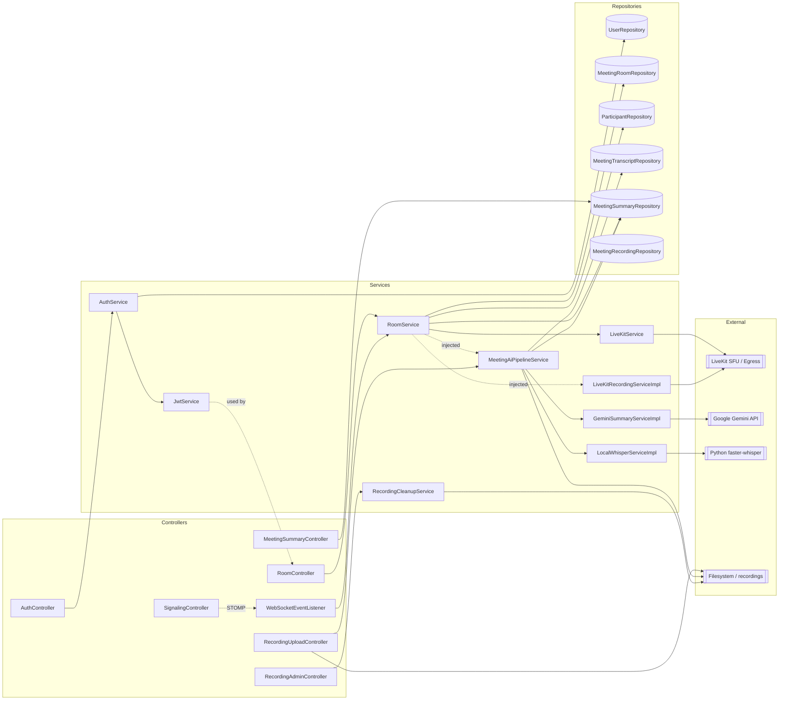

# Services Catalog

This document catalogs **every service / business-logic class** in the backend: its purpose, public methods, dependencies, and callers. Services that have a dedicated deep-dive doc are summarized here with a cross-link.

| Service | Package | Deep-dive doc |
|---|---|---|
| `AuthService` | `auth` | — (full detail here) |
| `JwtService` | `auth` | [docs/jwt.md](jwt.md) |
| `RoomService` | `room` | [docs/livekit-sfu.md](livekit-sfu.md), [docs/websocket-signaling.md](websocket-signaling.md) |
| `LiveKitService` | `sfu` | [docs/livekit-sfu.md](livekit-sfu.md) |
| `LiveKitRecordingService` / `…Impl` | `sfu` | [docs/livekit-sfu.md](livekit-sfu.md) |
| `MeetingAiPipelineService` | `ai.service` | [docs/ai-pipeline.md](ai-pipeline.md) |
| `LocalWhisperService` / `…Impl` | `ai.service` | [docs/ai-pipeline.md](ai-pipeline.md) |
| `GeminiSummaryService` / `…Impl` | `ai.service` | [docs/ai-pipeline.md](ai-pipeline.md) |
| `RecordingCleanupService` | `ai.service` | — (full detail here) |

> Related: [docs/controllers.md](controllers.md) lists the REST/STOMP endpoints that call these services.

---

## AuthService

`src/main/java/com/atharva/backend/auth/AuthService.java:14`

**Purpose:** Handles user registration (`signup`) and authentication (`login`). Validates uniqueness, hashes/verifies passwords, and mints a JWT for the new session.

**Dependencies (`@AllArgsConstructor`):**
- `UserRepository` — persistence + uniqueness checks (`existsByUsername`, `existsByEmail`, `findByUsername`, `findByEmail`).
- `PasswordEncoder` (BCrypt, see `SecurityConfig`) — hashes and matches passwords.
- `JwtService` — issues the access token.

| Method | Signature | What it does |
|---|---|---|
| `signup` | `AuthResponse signup(SignupRequest req)` (`:21`) | Rejects if username or email already exists (`IllegalArgumentException`). Builds a `User` with a BCrypt-hashed password, saves it, generates a JWT, returns `AuthResponse(token, username, displayName)`. |
| `login` | `AuthResponse login(LoginRequest req)` (`:42`) | Looks up user by username, falling back to email (`findByUsername(...).or(findByEmail(...))`). Throws `IllegalArgumentException("Invalid credentials")` if not found or password mismatch. On success, generates a JWT and returns `AuthResponse`. |

**Callers:** `AuthController` (`src/main/java/com/atharva/backend/auth/AuthController.java`) — `POST /api/auth/signup`, `POST /api/auth/login`.

---

## JwtService

`src/main/java/com/atharva/backend/auth/JwtService.java:16`

**Purpose:** Generates and validates HS256 JWTs. Tokens carry `sub = userId` and a `username` claim.

**Summary** (full detail in **[docs/jwt.md](jwt.md)**):
- Constructed from `${app.jwt.secret}` (HMAC key, must be ≥ 256 bits) and `${app.jwt.expiration-ms:3600000}` (`:20`).
- `generateToken(Long userId, String username)` → signed compact JWT (`:31`).
- `parseToken(String)` → `Claims`; `extractUserId(String)` → `Long` from subject (`:48`, `:56`).
- `isTokenValid(String)` → `boolean`; handles `ExpiredJwtException` / `SignatureException` gracefully, returning `false` (`:60`).

**Dependencies:** none beyond the configured secret (uses `io.jsonwebtoken` jjwt).

**Callers:** `AuthService` (token issuance) and `JwtAuthenticationFilter` (`auth/JwtAuthenticationFilter.java` — validates the `Authorization: Bearer` header on every protected request).

---

## RoomService

`src/main/java/com/atharva/backend/room/RoomService.java:34`

**Purpose:** Core meeting lifecycle: create rooms, join (with concurrency-safe participant counting and SFU token issuance), leave, host-close, and build meeting history. `@Slf4j`.

**Constants:** `DEFAULT_MAX_PARTICIPANTS = 100`, `ROOM_LIFETIME_HOURS = 4` (`:36`).

**Dependencies (constructor `:46`):**
- `MeetingRoomRepository` — room CRUD + pessimistic-lock lookup.
- `ParticipantRepository` — participant rows, history, bulk "mark left".
- `LiveKitService` — generates SFU access tokens (see [docs/livekit-sfu.md](livekit-sfu.md)).
- `LiveKitRecordingService` — injected but **not actively used** for server-side egress (recording is browser-driven; see note below).
- `MeetingAiPipelineService` — injected; pipeline is actually triggered by recording upload, not here.
- `MeetingSummaryRepository` — reads summary status for history items.

| Method | Signature | What it does |
|---|---|---|
| `createRoom` | `RoomResponse createRoom(User host, CreateRoomRequest req)` `@Transactional` (`:80`) | Generates a unique Zoom-style meeting ID (`xxx-xxxx-xxx`, `generateMeetingId()` `:66`), retries on collision. Builds a `MeetingRoom` (status `ACTIVE`, `expiresAt = now + 4h`, max participants capped), saves it, returns `RoomResponse`. |
| `joinRoom` | `JoinRoomResponse joinRoom(User user, String meetingId)` `@Transactional @Retryable(CannotAcquireLockException, 3 attempts, backoff 200ms ×2)` (`:129`) | Loads the room **`FOR UPDATE`** (pessimistic write lock). Rejects if `EXPIRED`/`CLOSED`; lazily flips to `EXPIRED` if past `expiresAt`; rejects if at capacity. Derives role (`HOST` if user == room host, else `GUEST`). First host join transitions `ACTIVE → RUNNING`. Idempotently finds-or-creates the `Participant`, increments `currentParticipantCount`, then calls `liveKitService.generateToken(...)`. **On SFU failure it rolls back the count and deletes the participant**, then throws. Returns `JoinRoomResponse` with the SFU token/URL, role and count. |
| `leaveRoom` | `void leaveRoom(User user, String meetingId)` `@Transactional` (`:221`) | No-op if room missing. Sets the participant's `leftAt = now`, decrements count (floored at 0). |
| `closeRoom` | `void closeRoom(User host, String meetingId)` `@Transactional` (`:244`) | Host-only (throws `SecurityException` otherwise). Sets status `CLOSED`, `closedAt = now`, and bulk-marks all active participants left via `markAllAsLeft`. AI pipeline is *not* triggered here (it is triggered by upload). |
| `getMeetingHistory` | `List<MeetingHistoryItemDto> getMeetingHistory(User user)` `@Transactional` (`:267`) | Loads the user's participations (newest first, `findHistoryByUserId`), maps each to `MeetingHistoryItemDto` and enriches it with the AI summary status (`NOT_AVAILABLE` if no summary row). |
| `generateMeetingId` | `private String generateMeetingId()` (`:66`) | Random UUID → 10 chars formatted `xxx-xxxx-xxx`. |
| `startRecordingAsync` | `private void startRecordingAsync(String meetingId)` (`:59`) | **No-op stub** — server-side LiveKit egress is disabled; recording is handled by browser-side `MediaRecorder`. Only logs. |

**Recording note:** Although `LiveKitRecordingService` and `MeetingAiPipelineService` are injected, RoomService no longer drives recording/AI directly. Recording is captured in the browser and POSTed to `RecordingUploadController`, which then invokes the AI pipeline.

**Callers:**
- `RoomController` — `/api/rooms/**` (create, join, leave, close, history).
- `WebSocketEventListener.handleDisconnect` (`signaling/WebSocketEventListener.java:87`) — calls `leaveRoom` when a WS session drops.

---

## LiveKitService

`src/main/java/com/atharva/backend/sfu/LiveKitService.java:13`

**Purpose:** Mints LiveKit (SFU) JWT access tokens for participants. `@Slf4j`.

**Summary** (full detail in **[docs/livekit-sfu.md](livekit-sfu.md)**):
- Constructed from `${livekit.api.key}`, `${livekit.api.secret}`, `${livekit.url}` (`:19`).

| Method | Signature | What it does |
|---|---|---|
| `generateToken` | `SfuTokenResponse generateToken(String roomName, String identity, boolean isHost)` (`:37`) | Builds a LiveKit `AccessToken` with the username as name/identity. Grants `RoomJoin`, `RoomName`, `CanPublish`, `CanSubscribe`; hosts additionally get `RoomAdmin(true)` (mute/kick). TTL = 6 hours. Returns `SfuTokenResponse(jwt, livekitUrl)`. Wraps failures in `RuntimeException("SFU token generation failed")`. |

**External dependency:** `io.livekit:livekit-server` SDK (`AccessToken` + grant classes).

**Callers:** `RoomService.joinRoom`.

---

## LiveKitRecordingService (interface) + LiveKitRecordingServiceImpl

`src/main/java/com/atharva/backend/sfu/LiveKitRecordingService.java:3`
`src/main/java/com/atharva/backend/sfu/LiveKitRecordingServiceImpl.java:26`

**Purpose:** Records meeting audio via the **LiveKit Egress** REST API into a Docker-mounted directory. `@Slf4j`.

> **Status:** Currently effectively **dormant** — `RoomService.startRecordingAsync` is a no-op and recording is browser-driven. This service remains as the server-side egress path. Full detail in **[docs/livekit-sfu.md](livekit-sfu.md)**.

**Config (`@Value`):** `${livekit.api.key}`, `${livekit.api.secret}`, `${livekit.url}`, `${recording.output.dir}` (host path that the Egress container's `/recordings` maps to).

**Internal state:** `egressIds` and `outputPaths` — `ConcurrentHashMap<meetingId, …>` tracking active egress jobs.

| Method | Signature | What it does |
|---|---|---|
| `startRecording` | `void startRecording(String meetingId)` (`:63`) | Idempotent (skips if already recording). Creates the host output dir, builds an OGG `EncodedFileOutput` at the **container** path `/recordings/{id}.ogg`, and starts an audio-only `RoomCompositeEgress` via `EgressServiceClient`. Stores `egressId` and the **host** path. Swallows errors (logs warnings) so the meeting continues without recording. |
| `stopAndGetRecordingPath` | `String stopAndGetRecordingPath(String meetingId)` (`:130`) | Removes the tracked egress, calls `stopEgress`, sleeps 3s for the file to flush via the Docker volume, and returns the **host-side** `.ogg` path (for Whisper). Falls back to `${outputDir}/{id}.ogg` if no active egress. |
| `toHttpUrl` | `private String toHttpUrl(String url)` (`:53`) | Converts `ws://`→`http://`, `wss://`→`https://` (Egress REST uses HTTP). |

**External dependency:** LiveKit `EgressServiceClient`, `LivekitEgress` protobufs.

**Callers:** Injected into `RoomService` (not actively invoked in current flow).

---

## MeetingAiPipelineService

`src/main/java/com/atharva/backend/ai/service/MeetingAiPipelineService.java:15`

**Purpose:** Orchestrates the async AI pipeline **transcribe → summarize → cleanup**. `@Slf4j`.

**Summary** (full detail in **[docs/ai-pipeline.md](ai-pipeline.md)**):

**Dependencies (constructor `:22`):** `MeetingTranscriptRepository`, `MeetingSummaryRepository`, `LocalWhisperService`, `GeminiSummaryService`.

| Method | Signature | What it does |
|---|---|---|
| `run` | `void run(String meetingId, String audioFilePath)` `@Async` (`:35`) | Runs off the request thread. If the audio file is missing, marks the summary `FAILED` with a helpful message and returns. Else finds-or-creates transcript/summary rows; **idempotent** (skips if `PROCESSING`/`COMPLETED`). Step 1: sets `PROCESSING`, calls `whisper.transcribe`, stores text, marks transcript `COMPLETED`. Step 2: calls `gemini.summarizeJson`, stores JSON, sets `model="gemini"`, marks summary `COMPLETED`. Step 3: deletes the recording file. On any failure both rows are marked `FAILED` (error truncated to 500 chars) and the file is deleted anyway. |
| `deleteRecordingFile` | `private void deleteRecordingFile(String audioFilePath)` (`:135`) | Best-effort delete; never throws. |

**Callers:** `RecordingUploadController.uploadRecording` (`recording/RecordingUploadController.java:51`) after persisting the uploaded audio.

---

## LocalWhisperService (interface) + LocalWhisperServiceImpl

`src/main/java/com/atharva/backend/ai/service/LocalWhisperService.java:3`
`src/main/java/com/atharva/backend/ai/service/LocalWhisperServiceImpl.java:19`

**Purpose:** Transcribes an audio file by shelling out to a local **faster-whisper** Python script. `@Slf4j`. Full detail in **[docs/ai-pipeline.md](ai-pipeline.md)**.

**Config:** `${whisper.command}` — a format string containing `%s` (the audio path placeholder). `TIMEOUT_MINUTES = 30`.

| Method | Signature | What it does |
|---|---|---|
| `transcribe` | `String transcribe(String audioFilePath)` (`:28`) | Substitutes the audio path into `whisper.command`, runs it via `cmd /c` (`ProcessBuilder`, stderr merged into stdout), waits up to 30 min (force-kills on timeout). Non-zero exit → `RuntimeException`. Prefers a sibling `{audio}.txt` file if the script wrote one; otherwise returns trimmed stdout. |

**External dependency:** OS process invoking Python + faster-whisper (`AI/transcribe.py`).

**Callers:** `MeetingAiPipelineService.run`.

---

## GeminiSummaryService (interface) + GeminiSummaryServiceImpl

`src/main/java/com/atharva/backend/ai/service/GeminiSummaryService.java:3`
`src/main/java/com/atharva/backend/ai/service/GeminiSummaryServiceImpl.java:18`

**Purpose:** Summarizes a transcript into structured JSON via the **Google Gemini** REST API. `@Slf4j`. Full detail in **[docs/ai-pipeline.md](ai-pipeline.md)**.

**Config:** `${gemini.api.key}`, `${gemini.model:gemini-2.0-flash}` (note: the request URL is hardcoded to `gemini-2.5-flash` on `v1beta`, `:57`). Uses a private `RestTemplate` and an injected `ObjectMapper`.

| Method | Signature | What it does |
|---|---|---|
| `summarizeJson` | `String summarizeJson(String transcriptText)` (`:34`) | Builds a prompt instructing Gemini to return ONLY JSON with keys `executiveSummary, keyPoints, decisions, actionItems, risks, openQuestions, followUps`. POSTs to the Gemini `generateContent` endpoint, extracts `candidates[0].content.parts[0].text`, strips markdown code fences, validates it parses as JSON, and returns the JSON string. Throws `RuntimeException` on failure (logs an API-key hint if invalid). |

**External dependency:** Google Generative Language API (`generativelanguage.googleapis.com`).

**Callers:** `MeetingAiPipelineService.run`.

---

## RecordingCleanupService

`src/main/java/com/atharva/backend/ai/service/RecordingCleanupService.java:21`

**Purpose:** Housekeeping for orphaned recording files in `${recording.output.dir:./recordings}`. `@Slf4j`. Enabled by `@EnableScheduling` on `BackendApplication`.

**Dependencies:** none (filesystem only).

| Method | Signature | What it does |
|---|---|---|
| `cleanupOldRecordings` | `void cleanupOldRecordings()` `@Scheduled(cron="0 0 3 * * ?")` (`:31`) | Runs daily at 03:00. Deletes `*.{ogg,mp3,wav,m4a}` files whose creation time is older than 24h. Logs deleted/error counts. |
| `cleanupAllRecordings` | `int cleanupAllRecordings()` (`:73`) | Deletes **all** matching recordings regardless of age; returns the count. |
| `getRecordingsDiskUsage` | `long getRecordingsDiskUsage()` (`:106`) | Sums the byte size of all regular files in the directory. |

**Callers:** `RecordingAdminController` (`ai/controller/RecordingAdminController.java`) — `POST /api/admin/recordings/cleanup`, `GET /api/admin/recordings/disk-usage`; plus the daily scheduler.

---

## Application-wide dependency graph

