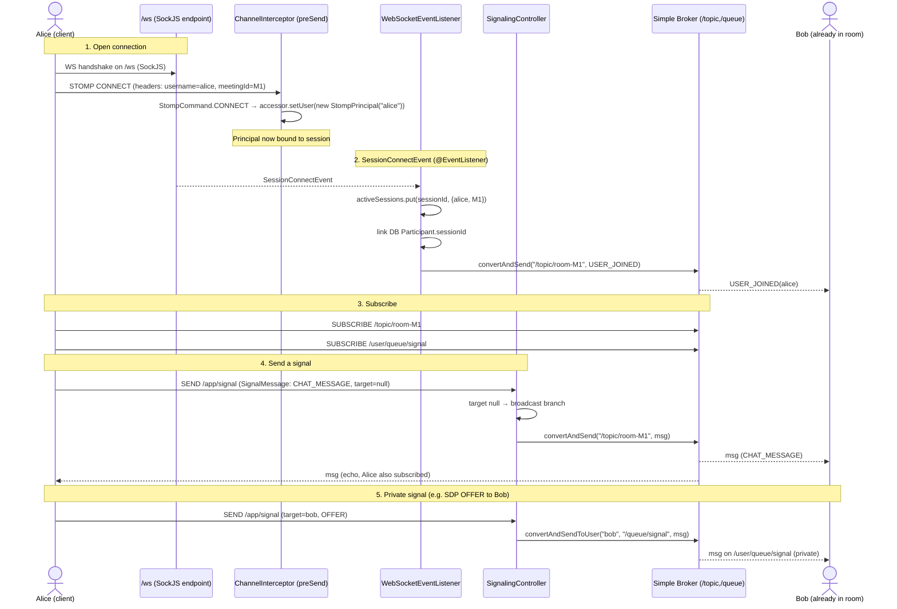
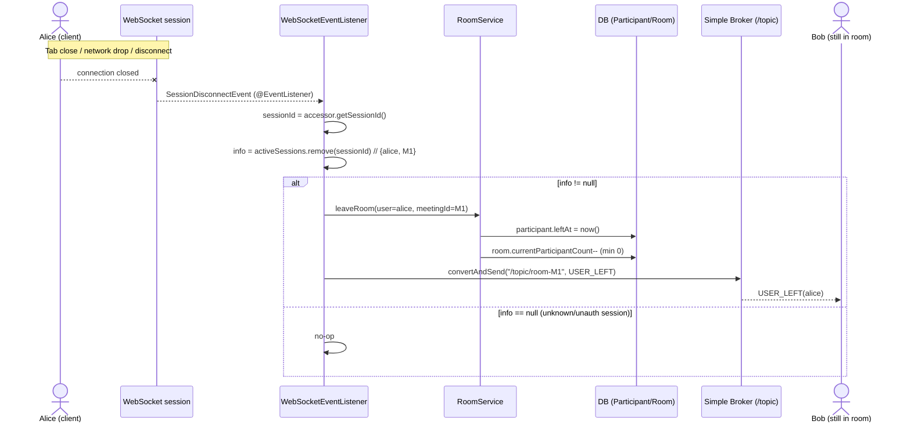

# WebSocket / STOMP Signaling Layer

This document explains the real-time signaling layer of the video conferencing backend: how
clients connect over WebSocket/STOMP, how users are authenticated and identified, how signaling
messages are routed and broadcast, and how participant **join/leave** is tracked through Spring
WebSocket lifecycle events.

It is written for someone who did **not** write this code and wants to **reuse the pattern** in
other projects. Wherever possible, exact class/annotation/method names are called out so you can
copy them.

> Media (audio/video) is **not** carried over these sockets — that goes through LiveKit (SFU).
> This layer only handles *signaling*: who joined/left, WebRTC SDP/ICE exchange (P2P fallback),
> chat, hand-raise, screen-share notifications, etc.

---

## 1. Source files at a glance

| File | Role |
|------|------|
| `src/main/java/com/atharva/backend/config/WebSocketConfig.java` | STOMP setup: endpoint, broker prefixes, auth interceptor |
| `src/main/java/com/atharva/backend/config/StompPrincipal.java` | `java.security.Principal` impl that holds the username |
| `src/main/java/com/atharva/backend/signaling/SignalingController.java` | `@MessageMapping` handlers that route/broadcast signals |
| `src/main/java/com/atharva/backend/signaling/WebSocketEventListener.java` | `@EventListener` handlers for connect/disconnect lifecycle |
| `src/main/java/com/atharva/backend/signaling/dto/SignalMessage.java` | The wire DTO |
| `src/main/java/com/atharva/backend/signaling/dto/SignalType.java` | Enum of signal kinds |
| `src/main/java/com/atharva/backend/room/RoomService.java` | DB-level room logic (`leaveRoom` called on disconnect) |

---

## 2. STOMP setup (`WebSocketConfig`)

`WebSocketConfig.java:16-18` is annotated with `@Configuration` + `@EnableWebSocketMessageBroker`
and implements `WebSocketMessageBrokerConfigurer`. That single annotation turns Spring's
message-broker machinery on. Three methods are overridden.

### 2.1 The connection endpoint — `registerStompEndpoints` (`WebSocketConfig.java:37-47`)

```java
registry.addEndpoint("/ws")
        .setAllowedOriginPatterns("*")
        .withSockJS();
```

| Aspect | Value | Meaning |
|--------|-------|---------|
| Endpoint URL | `/ws` | Clients open the WS handshake here: `ws://localhost:8080/ws` |
| CORS | `setAllowedOriginPatterns("*")` | Any origin may connect (tighten for production) |
| Fallback | `.withSockJS()` | Enables SockJS, so browsers without raw WebSocket fall back to XHR-streaming/polling. Client must use `new SockJS("http://localhost:8080/ws")` |

`/ws` is used **only** for the initial connection. After the STOMP session is up, all messaging
uses the destination prefixes below, never `/ws` again.

### 2.2 Broker & destination prefixes — `configureMessageBroker` (`WebSocketConfig.java:20-33`)

```java
registry.enableSimpleBroker("/topic", "/queue");   // server → client
registry.setApplicationDestinationPrefixes("/app"); // client → server
```

| Prefix | Direction | Backed by | Purpose |
|--------|-----------|-----------|---------|
| `/app` | Client → Server | Routed to `@MessageMapping` methods | Where clients **publish** signals (e.g. `stompClient.publish({destination:"/app/signal"})`) |
| `/topic` | Server → Client | In-memory **simple broker** | **Broadcast** fan-out. Everyone subscribed to `/topic/room-{meetingId}` gets the message |
| `/queue` | Server → Client | In-memory **simple broker** | **Per-user / private** delivery. Used by `convertAndSendToUser(...)`, which resolves to a user-specific queue |

> The "simple broker" is an **in-memory** broker (no RabbitMQ/ActiveMQ). It works for a single
> instance. For multi-instance you'd switch to a STOMP relay (`enableStompBrokerRelay`) and store
> session state in Redis (the code comments note this at `WebSocketEventListener.java:33-37`).

### 2.3 Authentication over WebSocket — `configureClientInboundChannel` (`WebSocketConfig.java:67-89`)

This is the **most reusable** piece. A `ChannelInterceptor` is registered on the **inbound**
channel. It is the WebSocket equivalent of a Servlet `Filter` / Spring Security filter, but it
runs on STOMP frames.

```java
registration.interceptors(new ChannelInterceptor() {
    @Override
    public Message<?> preSend(Message<?> message, MessageChannel channel) {
        StompHeaderAccessor accessor =
            MessageHeaderAccessor.getAccessor(message, StompHeaderAccessor.class);

        if (accessor != null && StompCommand.CONNECT.equals(accessor.getCommand())) {
            String username = accessor.getFirstNativeHeader("username"); // JWT/username header
            if (username != null) {
                accessor.setUser(new StompPrincipal(username)); // ← binds Principal to session
            }
        }
        return message;
    }
});
```

How the Principal is assigned, step by step:

1. The interceptor's `preSend` fires for **every** inbound STOMP frame.
2. It only acts on the `CONNECT` frame (`StompCommand.CONNECT`) — i.e. once, at handshake time.
3. It reads the native STOMP header `username` (`getFirstNativeHeader("username")`). In a real
   system this is where you'd validate a JWT and extract the subject.
4. `accessor.setUser(new StompPrincipal(username))` attaches a `Principal` to the session.

`StompPrincipal` (`StompPrincipal.java:9-21`) is a trivial `Principal`:

```java
public class StompPrincipal implements Principal {
    private final String name;
    public StompPrincipal(String name) { this.name = name; }
    @Override public String getName() { return name; }
}
```

**Why this matters:** once a `Principal` is on the session, Spring can do *user-targeted*
delivery. `messagingTemplate.convertAndSendToUser("bob", "/queue/signal", msg)` internally
resolves `"bob"` to **bob's** session(s) using this Principal. Without `setUser(...)`,
per-user messaging would not work.

---

## 3. Signaling endpoints (`SignalingController`)

`SignalingController.java:12-15` — `@Controller`, constructor-injects a single
`SimpMessagingTemplate messagingTemplate` (`SignalingController.java:17`). That template is the
server's tool for pushing messages out to clients.

There are **two** `@MessageMapping` handlers. (There is no `@SubscribeMapping` and no `@SendTo`
in this controller — broadcasting is done imperatively via `messagingTemplate`.)

### 3.1 Handler table

| # | Annotation / Destination | Client publishes to | Method | Payload | What it does | Sends to (destination) |
|---|--------------------------|---------------------|--------|---------|--------------|------------------------|
| 1 | `@MessageMapping("/signal")` (`:27`) | `/app/signal` | `handleSignal(SignalMessage)` | `SignalMessage` | If `targetUsername` is set → private delivery; else → room broadcast | **Private:** `convertAndSendToUser(target, "/queue/signal", msg)` → resolves to `target`'s `/queue/signal` (`:39-43`). **Broadcast:** `convertAndSend("/topic/room-" + meetingId, msg)` (`:47-50`) |
| 2 | `@MessageMapping("/room/{meetingId}/sdp")` (`:59`) | `/app/room/{meetingId}/sdp` | `handleSdp(@DestinationVariable String meetingId, SignalMessage)` | `SignalMessage` + path var | Dedicated SDP (offer/answer) channel for P2P fallback. Stamps `meetingId` from the URL onto the message; **drops** the message if `targetUsername` is null (`:66-69`) | **Private only:** `convertAndSendToUser(message.getTargetUsername(), "/queue/signal", msg)` (`:71-75`) |

### 3.2 Routing logic in `handleSignal` (`SignalingController.java:27-52`)

```text
client → /app/signal (SignalMessage)
   │
   ├── targetUsername present & non-empty ?
   │        └── YES → convertAndSendToUser(target, "/queue/signal", msg)   // private peer-to-peer
   │
   └── NO (null/empty) → convertAndSend("/topic/room-{meetingId}", msg)    // broadcast to whole room
```

- **Private path** is for things like a WebRTC SDP offer aimed at one specific peer.
- **Broadcast path** is for room-wide events (chat, hand-raise, etc.) where every subscriber of
  `/topic/room-{meetingId}` should receive it.

### 3.3 `@DestinationVariable` (`SignalingController.java:60-61`)

`/room/{meetingId}/sdp` captures `{meetingId}` from the destination via `@DestinationVariable`.
This is the STOMP analog of `@PathVariable`. The handler then forces that value onto the message
(`message.setMeetingId(meetingId)`) so the URL is the source of truth for the room.

---

## 4. Lifecycle events (`WebSocketEventListener`) — the core of join/leave tracking

`WebSocketEventListener.java:22-25` — `@Component`, injects `SimpMessagingTemplate` plus three
repositories and `RoomService`. It keeps an **in-memory** session registry:

```java
private final Map<String, SessionInfo> activeSessions = new ConcurrentHashMap<>();
// SessionInfo is a record: (String username, String meetingId)   (:100)
```

`activeSessions` maps **STOMP sessionId → {username, meetingId}**. This is the bridge that lets
the disconnect handler know *who* left and *which room*, because the disconnect frame only carries
a sessionId — not the username.

### 4.1 Events it listens to

This class uses Spring's generic `@EventListener` annotation (from
`org.springframework.context.event.EventListener`) — **not** `@MessageMapping`. Spring publishes
WebSocket session lifecycle events as application events, and any `@EventListener` method whose
parameter type matches will be invoked.

| Spring event class | Method (`@EventListener`) | When it fires | What the handler does |
|--------------------|---------------------------|---------------|------------------------|
| `org.springframework.web.socket.messaging.SessionConnectEvent` | `handleConnect(SessionConnectEvent)` (`:39-75`) | A client sends the STOMP `CONNECT` frame | Registers the session, links it to the DB `Participant`, and **broadcasts `USER_JOINED`** to the room |
| `org.springframework.web.socket.messaging.SessionDisconnectEvent` | `handleDisconnect(SessionDisconnectEvent)` (`:77-98`) | A client disconnects (tab close, network drop, explicit disconnect) | Removes the session, calls `RoomService.leaveRoom(...)`, and **broadcasts `USER_LEFT`** to the room |

> The codebase does **not** currently handle `SessionConnectedEvent` (fired after the broker
> acks the connect) or `SessionSubscribeEvent` (fired on each SUBSCRIBE frame). Those exist in
> Spring and follow the exact same `@EventListener` pattern if you ever need them — e.g.
> `@EventListener void onSub(SessionSubscribeEvent e)` to react to a client subscribing to a
> specific destination.

### 4.2 `handleConnect` step by step (`WebSocketEventListener.java:39-75`)

```java
@EventListener
public void handleConnect(SessionConnectEvent event) {
    StompHeaderAccessor accessor = StompHeaderAccessor.wrap(event.getMessage());
    String sessionId = accessor.getSessionId();
    String username  = accessor.getFirstNativeHeader("username");
    String meetingId = accessor.getFirstNativeHeader("meetingId");
    ...
}
```

1. **Unwrap headers** — `StompHeaderAccessor.wrap(event.getMessage())` gives access to the STOMP
   frame headers (`:41`). From it we read `sessionId`, and the native headers `username` and
   `meetingId` that the client supplied at connect time (`:42-45`).
2. **Guard** — proceed only if both `username` and `meetingId` are present (`:47`).
3. **Register session** — `activeSessions.put(sessionId, new SessionInfo(username, meetingId))`
   (`:48`). This is what makes later disconnect cleanup possible.
4. **Link DB participant to this socket** (`:50-61`):
   - find the room by `meetingId`,
   - find the user by `username`,
   - find their **active** participant row (`findByMeetingRoomAndUserAndLeftAtIsNull`),
   - stamp the live `sessionId` onto it and save. Now the DB row knows which socket the
     participant is on.
5. **Broadcast `USER_JOINED`** (`:66-73`): build a `SignalMessage` with
   `type=USER_JOINED, meetingId, senderUsername=username` and
   `convertAndSend("/topic/room-" + meetingId, joinMsg)` so everyone already in the room is told
   the new person arrived.

### 4.3 `handleDisconnect` step by step (`WebSocketEventListener.java:77-98`)

```java
@EventListener
public void handleDisconnect(SessionDisconnectEvent event) {
    StompHeaderAccessor accessor = StompHeaderAccessor.wrap(event.getMessage());
    String sessionId = accessor.getSessionId();
    SessionInfo info = activeSessions.remove(sessionId);
    if (info != null) { ... }
}
```

1. **Identify the session** — get `sessionId` from the disconnect frame (`:79-80`).
2. **Look up + remove** from `activeSessions` (`:82`). The returned `SessionInfo` tells us the
   `username` and `meetingId` — this is why we stored it on connect.
3. **DB cleanup** — find the user and call `roomService.leaveRoom(user, info.meetingId())`
   (`:86-88`). In `RoomService.leaveRoom` (`RoomService.java:220-238`) this sets `leftAt`,
   decrements `currentParticipantCount` (floored at 0), and saves — i.e. the participant is
   marked as gone and the room's live count drops.
4. **Broadcast `USER_LEFT`** (`:90-96`): build a `SignalMessage` with
   `type=USER_LEFT, meetingId, senderUsername=username` and
   `convertAndSend("/topic/room-" + info.meetingId, leaveMsg)` so the remaining clients update
   their UIs.

### 4.4 Pattern to remember (copy this into other projects)

If you want join/leave tracking + targeted/broadcast messaging anywhere else, these are the exact
names to reach for:

- **Enable it:** `@EnableWebSocketMessageBroker` on a `@Configuration` implementing
  `WebSocketMessageBrokerConfigurer`.
- **Endpoint:** `registry.addEndpoint("/ws").withSockJS()` in `registerStompEndpoints`.
- **Prefixes:** `enableSimpleBroker("/topic", "/queue")` + `setApplicationDestinationPrefixes("/app")`
  in `configureMessageBroker`.
- **Auth / identity:** a `ChannelInterceptor` registered via `configureClientInboundChannel`,
  whose `preSend` checks `StompCommand.CONNECT` and calls `accessor.setUser(new MyPrincipal(...))`.
  The accessor is obtained with `MessageHeaderAccessor.getAccessor(message, StompHeaderAccessor.class)`.
- **Receive from clients:** `@MessageMapping("/dest")` methods in a `@Controller`; capture path
  vars with `@DestinationVariable`.
- **Send to clients:** inject `SimpMessagingTemplate` and use
  - `convertAndSend("/topic/...", payload)` for **broadcast**, and
  - `convertAndSendToUser(username, "/queue/...", payload)` for **per-user** (needs the Principal).
- **Lifecycle hooks:** plain `@EventListener` methods (from `spring-context`) taking
  - `SessionConnectEvent` (connected), `SessionDisconnectEvent` (gone), and optionally
    `SessionConnectedEvent` / `SessionSubscribeEvent` / `SessionUnsubscribeEvent`.
  - Inside them, unwrap with `StompHeaderAccessor.wrap(event.getMessage())` to read
    `getSessionId()` and `getFirstNativeHeader(...)`.
- **Session→user bridge:** keep a `ConcurrentHashMap<sessionId, info>`; populate on connect,
  `remove()` on disconnect. The disconnect frame only has the sessionId, so this map is how you
  recover *who* left.

---

## 5. The wire DTO and enum

### 5.1 `SignalMessage` (`dto/SignalMessage.java:5-12`)

Lombok `@Data` (getters/setters/`toString`/`equals`). Every signal in/out of this layer is one of
these.

| Field | Type | Meaning |
|-------|------|---------|
| `type` | `SignalType` | What kind of signal this is (see enum below) |
| `meetingId` | `String` | The room this signal belongs to (drives `/topic/room-{meetingId}`) |
| `senderUsername` | `String` | Who sent it |
| `targetUsername` | `String` | If set → private delivery to that user; if `null`/empty → broadcast to the room |
| `payload` | `Object` | Free-form body: SDP, ICE candidate, chat text, etc. (serialized as JSON) |

### 5.2 `SignalType` (`dto/SignalType.java:3-21`)

| Value | Category | Meaning |
|-------|----------|---------|
| `OFFER` | WebRTC handshake | SDP **offer** (P2P fallback / custom SFU) |
| `ANSWER` | WebRTC handshake | SDP **answer** |
| `ICE_CANDIDATE` | WebRTC handshake | An ICE candidate for NAT traversal |
| `USER_JOINED` | Room lifecycle | Someone connected to the room (emitted by `handleConnect`) |
| `USER_LEFT` | Room lifecycle | Someone disconnected (emitted by `handleDisconnect`) |
| `HAND_RAISED` | In-call feature | Participant raised their hand |
| `HAND_LOWERED` | In-call feature | Participant lowered their hand |
| `CHAT_MESSAGE` | In-call feature | A chat message (text in `payload`) |
| `SCREEN_SHARE_STARTED` | In-call feature | Participant started screen share |
| `SCREEN_SHARE_STOPPED` | In-call feature | Participant stopped screen share |
| `MUTE_REQUEST` | In-call feature | Host asks a participant to mute |
| `ROOM_CLOSED` | In-call feature | Broadcast: host ended the meeting |

> Note: `USER_JOINED` / `USER_LEFT` are produced **server-side** by the event listener. The other
> types are typically sent by clients through `/app/signal` and relayed.

---

## 6. End-to-end flows

### 6.1 Connect → subscribe → signal → broadcast → receive



### 6.2 Disconnect → cleanup



---

## 7. Quick reference: destinations

| Direction | Destination | Used by |
|-----------|-------------|---------|
| Client → Server | `/app/signal` | `SignalingController.handleSignal` |
| Client → Server | `/app/room/{meetingId}/sdp` | `SignalingController.handleSdp` |
| Server → Client (broadcast) | `/topic/room-{meetingId}` | room-wide messages, `USER_JOINED`, `USER_LEFT` |
| Server → Client (private) | `/queue/signal` (resolved per-user via `convertAndSendToUser`) | private SDP/ICE/targeted signals |

**Client connect headers required:** `username` (consumed by the interceptor for the Principal and
by the connect listener) and `meetingId` (consumed by the connect listener for room tracking).
